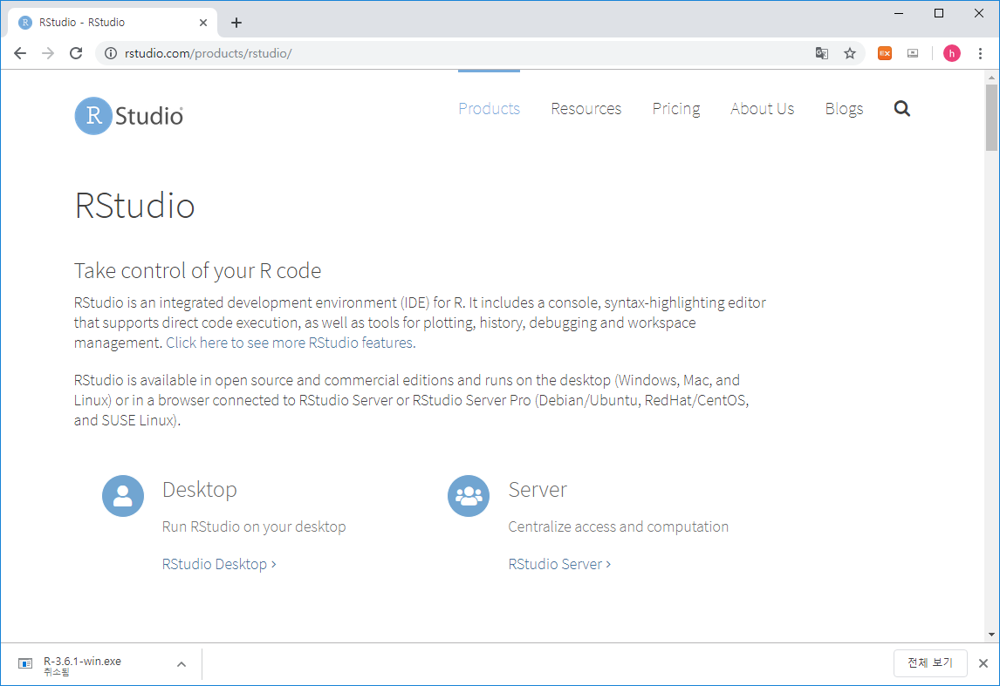

# R basics  

## What is R / Rstudio 

<center>

</center>

R 사용을 위해서는 R 언어의 코어 프로그램을 먼저 설치하고 그 다음 R 언어용 IDE인 RStudio 설치가 필요합니다.  

## R / Rstudio installation

- R 사이트에 접속 후 (https://www.r-project.org/) 좌측 메뉴 상단에 위치한 CRAN 클릭. 
  

- 미러 사이트 목록에서 Korea의 아무 사이트나 들어감
  

- Download R for Windows를 클릭 후 base 링크 들어가서 
  
  

- Download R 3.6.3 for Windows 링크로 실행 프로그램 다운로드 (2020.3 현재 R 버전은 3.6.3). 로컬 컴퓨터에 Download 된 R-3.6.3-win.exe 를 실행하고 설치 프로그램의 지시에 따라 R 언어 소프트웨어 설치를 완료합니다. 

  


 
- Rstudio는 R 언어를 위한 오픈소스 기반 통합개발환경(IDE)으로 R 프로그래밍을 위한 편리한 기능들을 제공해 줍니다. 다음 사이트에 접속 (https://www.rstudio.com/), 상단의 Products > RStudio 클릭
  

- RStudio Desktop 선택
  

- Download RStudio Desktop 클릭
  

- RStudio Desktop Free 버전의 Download를 선택하고
  

- Download RStudio for Windows (2020.03현재 version 1.2.5033) 클릭, 다운로드. 로컬 컴퓨터에 다운로드된 RStudio-1.2.5033.exe를 실행하고 설치 가이드에 따라 설치 완료합니다. 
  


## Rstudio interface
- 아래 그림의 좌측 상단의 공간은 코드편집창, 좌측 하단은 콘솔창 입니다. 


## Keyboard shortcuts

- 참고사이트 
  - https://support.rstudio.com/hc/en-us/articles/200711853-Keyboard-Shortcuts
  - Tools --> Keyboard shortcut Quick Reference (```Alt + Shift + K```)
- 코드편집창 이동 (```Ctrl+1```) 콘솔창 이동(```Ctrl+2```)
- 한 줄 실행 (```Ctrl+Enter```)
- 주석처리 (```Ctrl + Shift + C```) 
  - 또는 ```#```으로 시작하는 라인 

- 실습
  - 코드편집창에서 다음 입력 
  -   
  - 단축키 ```Ctrl + enter```로 코드 실행 
  - 단축키 ```Ctrl + 2```로 커서 콘솔창으로 이동
  - ```x```값 ```x+y```값 확인 
  - 단축키 ```Ctrl + 1```로 코드편집창 이동 
  - 단축키 ```Ctrl + Shift + C``` 사용

```{r, eval=F}
# x <- 10
# y <- 20

```


## Set working directory  

- 시작 전 항상 작업 디렉토리 설정 
- 예를 들어 c:\ 아래 새로운 디렉토리 rprog01 을 만들고 작업공간으로 설정  

```{r, eval=FALSE}
getwd()
dir()
setwd("C:\\rprog01")
getwd()
dir()
```

- 또는 아래와 같이 RStudio 메뉴 에서 설정 
  

## Help

- R의 장점 중 하나 (예제 포함)

```{r, eval=F}
?
?mean
help("mean")
example("mean")
help.search("mean")
help(package="MASS")
```


## RStudio workspace


## R packages

- R comes ready loaded with various libraries of functions called packages
 + ex) sum() is in the “base” package and sd() in the “stats” package
- The packages can be found in numerous server locations on the web called repositories
 + The Comprehensive R Archive Network (CRAN) http://cran.r-project.org/web/views/
 + Bioconductor specialised in genomics http://www.bioconductor.org/packages/release/bioc/
 


- UsingR package installation


- UsingR package loading

```{r, eval=F}
library(UsingR)
```

- R 설치 디렉토리
- R 패키지 설치 디렉토리

```{r, eval=F}
.libPaths()
path.package()
```


## Data sets

- Packages include accompanying data sets
- R has a datasets package that is loaded automatically
- The data function  produces a copy of dataset in user’s workspace

```{r, eval=F}
head(rivers)
length(rivers)
class(rivers)
data(rivers)
data(package="UsingR")
library(HistData)
head(Cavendish)
str(Cavendish)
head(Cavendish$density2)
```


## Cheatsheet


