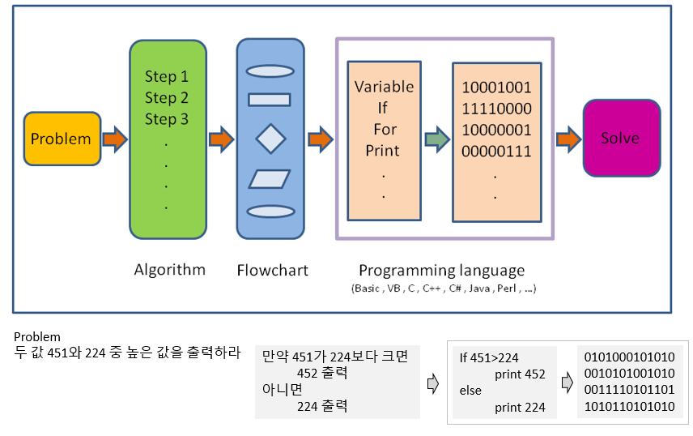

# R programming basics

## Terminology

- Session: R 언어 실행 환경 
- Console: 명령어 입력하는 창 
- Code: R 프로그래밍 변수/제어문 모음 
- Objects (개체, variable): 데이터(값, value)가 저장되는 장소 
- Object (variable) types:
  - Vectors: 값들의 모임 combine function ```c()``` EX: c(6, 11, 13, 31, 90, 92)
  - Factors: 범주형 데이터 저장 장소
  - Data frames: 2D matrix 형태 데이터 자장 장소 
- Data (value) types: Integers, doubles/numerics, logicals, and characters.
- Conditionals (조건, 제어):
  - ```if```, ```==```, ```&``` (AND), ```|``` (OR) Ex: ```(2 + 1 == 3) & (2 + 1 == 4) ```
  - ```for```, ```while```: 반복 수
- Functions (함수, commands): 특정 일 수행, 함수이름 - 입력값 (arguments) - 출력값 (output) 으로 구성 


## R console script  

콘솔에서 바로 계산을 수행할 수 있습니다. 참고로 이전에 수행한 명령은 콘솔에 커서가 있는 상태에서 위 아래 화살표를 누르면 볼 수 있고 엔터를 눌러 재사용 할 수 있습니다. ```;```을 사용하면 두 개의 명령을 동시에 수행할 수 있습니다. 

$$ 2 + 2 $$
$$ ((2 - 1)^2 + (1 - 3)^2)^{1/2} $$

```{r, eval=FALSE}
2 + 2
((2 – 1)^2 + (1 – 3)^2 )^(1/2)
2 + 2; 2 - 2
```


## What is a programming language 





## Variables and values 

- R is a programming language 
- Assignment operator ( `<-` OR `=` )
  - Valid object name `<-` value 
  - 단축키: `Alt + -` (the minus sign)
- 내장 변수 Built-in variables

```{r, eval=FALSE}
x <- 2
y <- x^2 – 2*x + 1
y
x <- "two"  
some_data <- 9.8
pi
```

- 변수이름 작명법 
  - Characters (letters), numbers,  “_”,  “.”
  - A and a are different symbols
  - Names are effectively unlimited in length

```{r, eval=F}
i_use_snake_case <- 1
otherPeopleUseCamelCase <- 2
some.people.use.periods <- 3
And_aFew.People_RENOUNCEconvention <- 4
```

- 자동 완성 기능 (Tab completion) in RStudio


## Variable type of (storage) mode


## Variable - Vectors 

- Combine function `c()`: Concatenating elements end to end

```{r, eval=FALSE}
x <- c(10.4, 5.6, 3.1, 6.4, 21.7) 
y <- c("X1", "Y2",  "X3",  "Y4")

i <- 1:3
x[i]

```

- 인덱싱: Subsets of the elements of a vector 

```{r, eval=F}
x[1]
x[1:3]
x[c(1,2,4)]
y[3]
```


## Functions

함수(Function)는 프로그래밍 과정에서 사용자가 필요로하는 기능을 수행하는 명령어를 말하며 다음과 같은 포멧으로 함수를 구현할 수 있습니다. 

```{r, eval=FALSE}
myfunction.name <- function(para1, para2, ... ){
  statements
  return(object)
}
```

예를 들어 다음과 같은 ```my_sine``` 함수를 만들 수 있으며 ```x```는 parameter (매개변수)이고 ```y```는 반환값을 저장하는 지역변수 입니다.

```{r, eval=FALSE}
my_sine <- function(x){
	y <- sin(x)
	return(y)
}
```

만들어진 함수는 다음과 같이 사용할 수 있습니다. 여기서 함수로 전달되는 값 ```pi```는 argument (전달인자) 라고 합니다. 전달인자는 함수에서 정의된 매개변수의 갯수와 같은 수의 전달인자를 입력해 주어야 합니다. 

```{r, eval=F}
my_sine(pi)
```

- Terminology 
  - function name: `my_sine`
  - parameter: `x`
  - argument: `pi`
  - return value: `y`


다음 코드를 보면 전역변수 ```x```, ```y```는 지역변수 ```x```, ```y```와 독립적으로 사용됨을 알 수 있습니다. 

```{r, eval=F}
my_half <- function(x){
  y <- x/2
  cat("local variable x:", x, "\n")
  cat("local variable y:", y, "\n")
  return(y)
}
y <- 100
x <- 20
cat("Global variable x:", x, "\n")
cat("Global variable y:", y, "\n")
my_half(5)
```

```log```, ```sin```등의 함수들은 Built-in function으로 같은 이름의 함수를 만들지 안도록 주의합니다. 


```{r, eval=F}
x <- pi
sin(x)
sqrt(x)
log(x)
log(x, 10)
x <- c(10, 20, 30)
x + x
mean(x)
sum(x)/length(x)
```


## Vectorized functions
```{r, eval=F}
x <- c(10, 20, 30)
x + x
sqrt(x)
sin(x)
log(x)
x-mean(x)
```

## Exercise 3-1

다음은 한 다이어트 프로그램의 수행 전 후의 다섯 명의 몸무게이다. 


- 각각을 before 와 after 이름의 변수에 저장 후 몸무게 값의 변화량을 계산하시오. 
  - before값들의 평균을 구하시오 (mean() 함수 사용)
- my_mean 이라는 이름의 함수로 평균을 구하는 코드를 작성 하시오 (빌트인 함수 사용하지 않음)
  - 함수이름: my_mean
  - parameter: x 
  - return 값: y 
  - (x[1]+x[2]+x[3]+x[4]+x[5])/5
- 빌트인 함수 sum()과 length()를 이용해 동일한 기능을 하는 함수를 작성하시오
  - 함수이름 my_mean2
  - sum(), length() 사용


