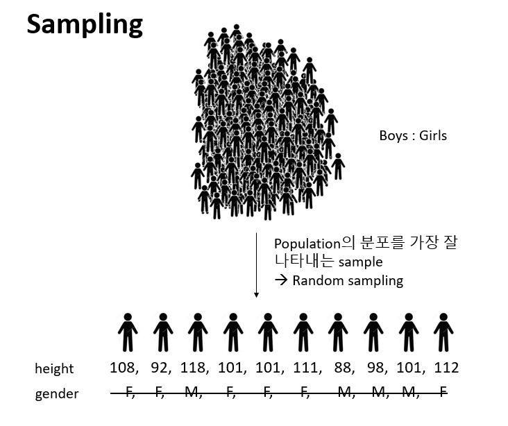
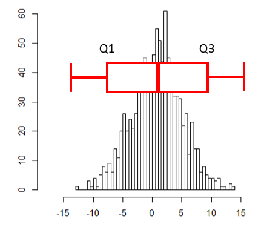

# Basic Statistics 

## Univariat data

- Statistics: 데이터 분석을 통한 예측. 즉, 데이터를 수집, 정리하여 이로부터 미지의 사실에 대한 신빙성 있는 추론을 수행하는 과정


- Univariate (단변량): Single variable 


$$ x_1, x_2, ..., x_n $$
```{r, eval=F}
x <- c(1, 2, 3, 4, 5)
length(x)
```


- 데이터의 속성에 따른 구분 
- 범주형 - 질적 데이터, 숫자로 나타낼 수 있으나 의미 없음
  + 명목형 (Nominal) - 사람 이름
  + 순서형 (Ordinal) – 달리기 도착 순서
- 수치형 - 숫자로 나타내며 데이터 속성을 그대로 지님님
  + 구간형 (Interval) – 선수1, 선수2 종점통과 시간
  + 비율형 (Ratio) – 출발시간 기준 종점 통과 시간


- Data type in R
  + Numeric data types (수치형)
    + Discrete (이산형) data - 카운트, 횟수 
    + Continuous (연속형) data - 키, 몸무게, Cannot be shared
  + Factors data - 혈액형, 지역 (범주형)
  + Character data - ID, 이름 (범주형)
  + Logical data - 참, 거짓 (논리형)

### Vectors for univariate data

- Using combine function 

```{r, eval=F}
#The number of whale beachings in Texas during the 1990s
whale <- c(74, 122, 235, 111, 292, 111, 211, 133, 156, 79)
#Object `whale` is a data vector == (univariate) data set

# The size 
length(whale)
sum(whale)
sum(whale)/length(whale)
mean(whale)
```


- Vectorization

```{r, eval=F}
whale - mean(whale)
whale^2 - mean(whale)
sqrt(whale)
```


- Adding values to a vector variable

```{r, eval=F}
x <- 1
x <- c(x, 2)
x
x <- c(x, 3, 3, 3, 4)
x
```


- Missing/NULL values
  + NA: Not available, The value is missing 
  + NULL: a reserved value
  + NaN: Not a number (0/0)
  + Inf: (1/0)

```{r, eval=F}
hip_cost <- c(10500, 45000, 74100, NA, 83500)
sum(hip_cost)
sum(hip_cost, na.rm=TRUE)
?sum
```

- Attributes: names in data vectors

```{r, eval=F}
head(precip)
class(precip)
length(precip)
names(precip)
order(names(precip))

test_scores <- c(100, 90, 80)
names(test_scores) <- c("Alice", "Bob", "Shirley")
```

- Indexing 

```{r, eval=F}
head(precip)
precip[1]
precip[2:10]
precip[c(1,3,5)]
precip[-1]
precip["Seattle Tacoma"]
precip[c("Seattle Tacoma", "Portland")]
precip[2] <- 10
```


### Data type
 - Numeric data
```{r, eval=F}
class(1)
class(pi)

x <- seq(1,5,by=1)
class(x)
seq(0, 100, by=10)
seq(0, 100, length.out=11)
?seq
rep(5, times10)
rep(1:3, times=4)

```
 
 - Character data
```{r, eval=F}
ch <- c("Lincoln", "said", "and")
class(ch)
```


#### Exercise 
 * `seq` 또는 `rep` 함수를 사용해서 다음 서열들을 만들고 `x` 변수에 저장하시오 
 * "a", "a", "a", "a", "a" 
 * 1, 3, 5, 7, ..., 99
 * 1, 1, 1, 2, 2, 2, 3, 3, 3
 * 1, 2, 3, 4, 5, 4, 3, 2, 1

Combining strings - paste function
```{r, eval=F}
paste("X", 1:10)
paste("X", 1:10, sep="")
paste("The", "quick", "brown", "fox")
paste(c("The", "quick", "brown", "fox"))
paste(c("The", "quick", "brown", "fox"), collapse=" ")
x <- 1:10
paste(x)
paste(x, collapse=":")
```

Factors 
```{r, eval=F}
x <- c("Red", "Blue", "Yellow", "Green", "Blue", "Green")
y <- factor(x)
y
```
 
Adding a level 
```{r, eval=F}
levels(y)
y[1] <- "Gold"
y
```
```{r, eval=F}
levels(y) <- c(levels(y), "Gold")
levels(y)
y
y[1] <- "Gold"
y
```

Logical data
 * TRUE and FALSE
 * "is" functions
 * Comparison by `<`, `<=`, `==`, `!=`, `>=`, `>`
 * Combination by `!`, `&`, `|`

```{r, eval=F}
is.na(1)
is.numeric(1)
is.logical(TRUE)

pi < 3
precip < 30
which(precip < 30)
any(precip < 30)
all(precip < 30)
any(39 == precip)
which(39 == precip)
sum(precip < 30)
sum(c(TRUE, TRUE))

x <- 1:100
x < 10
x > 90
x < 10 | x >90
which(x < 10 | x >90)
i <- which(x < 10 | x >90)
x[i]
x[x < 10 | x >90]
```


#### Exercise
다음은 신생아들의 키를 나타내는 dataset 이다. 오류 값을 찾아내고 이들 값을 `NA`로 바꾼 후 평균 값을 구하시오 (`babies` 데이터셋은 `UsingR` 패키지에 있으며 오류값은 999 입니다)
```{r, eval=F}
x <- babies$dwt
x
```

#### Exercise 
특정 숫자가 짝수인지를 검사하는 방법은 해당 숫자를 2로 나누어 나머지가 0인지 확인하는 방법이다. `2 %% 2 == 0` 위와 같은 코드로 이를 구현할 수 있다. 다음 변수의 값들 중 짝수의 개수를 구하는 코드를 작성하시오 (1줄 코드임). 

```{r, eval=F}
x <- c(12, 3, 4, 2, 28, 11, 8, 9, 51, 89)
```


### Use of functions

Function 정의
```{r, eval=FALSE}
my_sine <- function(x){
	y <- sin(x)
	return(y)
}
```

사용법 
```{r, eval=F}
my_sine(pi)
```

- 용어 
  - function name: `my_sine`
  - parameter: `x`
  - argument: `pi`
  - return value: `y`


평균 계산하는 함수 `my_mean`

```{r, eval=F}
head(rivers)
my_mean <- function(x){
	total <- sum(x)
	n <- length(x)
	return(total/n)
}
my_mean(rivers)
```


#### Exercise
평균과의 거리를 계산하는 `get_dist` 함수를 작성하고 `rivers` 데이터에 사용하시오 

```{r, eval=F}

get_dist <- function(x){
	return()
}

get_dist(rivers)
```


#### Exercise
강수량 데이터 `precip`에서 연평균 강수량이 50 이상인 도시를 뽑고 해당 도시들의 강수량에 따라서 순서대로 나열하시오 


### Numeric summaries
<center>


<br>

</center>

- 대푯값 (요약값)
- Center – commonly known as “average” or “mean” but not the only one. 
  + median, mode, etc
  
- Spread – Variability of a data set. 
  + No variability – mean is everything 
  + Large variability – mean informs much less
  + confidence of interpretation from knowing center
  + Distance from center
  
- Shape – Degree of interpretation from knowing center and spread. 
  + eg. bell shape – two sides are equally likely, large values are rather unlikely and values tend to cluster near the center.


### Center for a univariat variable

<center>

</center>

#### Sample mean
$$ \bar{x} = \frac{1}{n} (x_1 + x_2 + ... + x_n) = \frac{1}{n}\sum_i{x_i} $$ 

```{r, eval=F}
length(rivers)
plot(rivers)
mean(rivers)
devs <- rivers - mean(rivers)
plot(devs)
mean(devs)
```

- Robustness 

```{r, eval=F}
mean(devs)
median(devs)
plot(devs)
abline(h=mean(devs), col="red")
abline(h=median(devs), col="blue")
devs <- devs[devs<1500]
abline(h=mean(devs), col="red", lty=2)
abline(h=median(devs), col="blue", lty=2)
```

### Spread for a univariat variable

<center>

</center>

- Range - the distance between the smallest and largest values 
- Sample variance 
\begin{equation}
 s^2 = \frac{1}{n-1}\sum_i(x_i - \bar{x})^2
\end{equation}

- Sample standard deviation
  + 측정값들이 평균에서 떨어진 정도 
\begin{equation}
 \sqrt{s^2} = \sqrt{ \frac{1}{n-1}\sum_i(x_i - \bar{x})^2 }
\end{equation}

  
```{r, eval=F}
wts <- kid.weights$weight
var(wts)
sd(wts)

plot(wts)
boxplot(wts)
hist(wts)
hist(wts, breaks = 50)
hist(wts, 50)
abline(v=mean(wts), col="red")
```


- Interquartile range (IQR) 
  + Middle 50% of the data
  + Difference between Q3 and Q1

<center>

</center>


### Shape for a univariat variable

<center>

</center>
 
- Symmetry and skew

\begin{equation}
 \text{sample skewness} = \sqrt{n} \frac{\sum{(x_i - \bar{x})^2}}{(\sum{(x_i - \bar{x})^2)^{3/2}}} = \frac{1}{n}\sum{z_i^3}
\end{equation}


```{r, eval=F}
myskew <- function(x){
  n <- length(x)
  z <- (x-mean(x))/sd(x)
  return(sum(z^3)/n)
}

wts <- kid.weights$weight
hist(wts, 50)
myskew(wts)

z <- rnorm(length(wts))
hist(z, br=50)
myskew(z)
```

- Sample excess kurtosis 
  + Measure of tails
  
\begin{equation}
  \text{sample excess kurtosis} = n \frac{\sum{(x_i - \bar{x})^4}}{(\sum{(x_i - \bar{x})^2)^2}} -3 = \frac{1}{n}\sum{z_i^4} - 3
\end{equation}

```{r, eval=F}
mykurtosis <- function(x){
  n <- length(x)
  z <- (x-mean(x))/sd(x)
  return(sum(z^4)/n - 3)
}

wts <- kid.weights$weight
hist(wts, 50)
mykurtosis(wts)

z <- rnorm(length(wts))
hist(z, br=50)
mykurtosis(z)
```

### Viewing the shape

#### Histogram 

도수분포표를 나타낸 그림으로 데이터를 특정 범위의 그룹으로 짝짓고 해당 범위와 그룹의 크기에 해당하는 막대를 그린 그래프입니다. 

```{r, eval=F}
x <- faithful$waiting
hist(x)
hist(x, breaks = 1000)
hist(x, breaks = 20, freq=FALSE)
hist(x, breaks = 20, freq=FALSE, main="Histogram")
hist(x, breaks = 20, freq=FALSE, main="Histogram", xlim=c(0, 100))
hist(x, breaks = 20, freq=FALSE, main="Histogram", xlim=c(0, 100), ylim=c(0, 0.1))
```

히스토그램은 center (mean, median), spread (Variance, IQR), shape (tail)을 모두 볼 수 있는 그래프입니다. 그리는 방법은 전체 범위의 데이터가 포함되도록 범위를 정하고 동일 같격으로 구분되는 계급의 개수를 정한 후 해당 계급에 속하는 데이터의 개수를 세어 도수를 구합니다. 다음은 도수 분포표를 만드는 코드 입니다.

```{r, eval=F}
x <- faithful$waiting
bins <- seq(40, 100, by=5)
out <- cut(x, breaks=bins)
table(out)
plot(table(out))
```


#### Density plots 

히스토그램을 갖는 하나의 단변량 변수가 있을 때 특정 값이 선택될 확률은 히스토그램의 해당 계급의 도수값을 전체로 나눈 값이라고 할 수 있습니다. 그런나 연속적인 구간이나 시간의 경우에는 히스토그램보다는 density plot이 요약값을 보기에 더 적합합니다. 


```{r, eval=F}
wts <- kid.weights$weight
xrange <- range(wts)
den <- density(wts)
plot(den, xlim=xrange, xlab="densities", main="")
```


#### Boxplots 
상자그림 또는 상자 수염 그림으로 불리는 boxplot은 다섯개의 주요 요약값을 (min, max, Q1, Q3, and median) 보여주며 대규모 데이터를 한 눈에 비교할 수 있는 좋은 방법 입니다. 


- Boxplot

```{r, eval=F}
x <- 0:5
quantile(x)
boxplot(x)
text(x=1.3, y=quantile(x, 0.25), labels = "1사분위수")
text(x=1.3, y=quantile(x, 0.5), labels = "2사분위수")
text(x=1.3, y=quantile(x, 0.75), labels = "3사분위수")
```


```{r, eval=F}
boxplot(kid.weights)
boxplot(kid.weights$weight)

#install.packages("vioplot")
library(vioplot)
vioplot(kid.weights)
vioplot(kid.weights, col=c("#3CAEA3", "#F6D55C", "#ED553B"), rectCol=c("gray"), main="Kids")
?vioplot

#console
par(mfrow=c(1,2))
plot(density(kid.weights$weight))
vioplot(kid.weights$weight)

```


#### Exercise
다음 데이터를 `age` 변수에 저장하고 mean, median, variance 를 구하시오. 또한 age의 `boxplot`을 그리고 중간값을 출력하시오

```{r, eval=F}
{7,   9,   2,  64,  41,  60,  82,  31,  38,  25,  52,  68,  67}
```


## Bivariate data

두 변수를 동시에 고려할 경우 각 변수가 가지고 있는 데이터를 비교하여 변수간의 유사성이나 관계 (상관, 독립)에 대한 설명하는 방법을 소개하며 짝데이터 (Paired data)나 범주형 데이터의 경우에 두 변수의 관계를 어떻게 설명하는지 알아봅니다. 또한 그래프를 이용하여 두 변수의 관계를 가시화 하는 방법에 대해 알아보겠습니다.  


### Independence samples

두 변수간의 관계를 설명할 때 가장 일반적인 경우의 데이터 형태는 코흐트 데이터 입니다. 처리군과 대조군으로 이루어진 데이터를 말하며 플라시보 (Placebo effect) 효과를 방지하기 위해서 실제 효과는 없지만 대조군에 처리한 조건과 동일한 조건의 처리를 수행합니다. 

```{r, eval=F}
beets <- c(41, 40, 41, 42, 44, 35, 41, 36, 47, 45)
no_beets <- c(51, 51, 50, 42, 40, 31, 43, 45)
```

위 데이터는 비트의 효과를 검증하기 위해  각 실험자의 달리는 시간을 측정하고 비교한 데이터 입니다. 이 데이터를 보고 알 수 있는 사실은 무엇입니까? 


### Data comparison with plots

두 변수에 대한 관계를 가장 먼저 그리고 가장 직관적으로 설명하는 방법은 그래프 입니다. `boxplot`에서는 앞에서 배운바와 같이 다섯 가지 요약값을 볼 수 있습니다. 1사분위수, 2사분위수(중간값), 3사분위수, 그리고 최대, 최소값입니다. 여기서 최대 최소는 3사분위수 또는 1사분위수에서 IQR 1.5배에 해당하는 하위 또는 상위 값으로 그 범위를 벗어나는 값들은 outlier로 취급합니다. 


```{r, eval=F}
boxplot(beets, no_beets)
boxplot(beets, no_beets, names=c("beets", "no_beets"))
```


`Density plot`은 histogram과 비슷하게 데이터의 center, spread, 그리고 shape를 모두 보여주는 높은 활용도 때문에 많이 사용되는 그래프 입니다. `density` 함수는 밀도함수를 추정하고 주어진 범위의 x값과 그에 대한 y값을 반환해주며 plot 함수를 이용하여 x와 y위치에 점이나 선을 그려주어 그래프를 완성합니다. 


```{r, eval=F}
library(UsingR)
head(michelson)
?michelson
str(michelson)
speed <- michelson$Speed 
expt <- michelson$Expt
fourth <- speed[expt == 4]
fifth <- speed[expt == 5]
d4 <- density(fourth)
d5 <- density(fifth)
xrange <- range(c(d4$x, d5$x))
yrange <- range(c(d4$y, d5$y))
plot(d4, xlim=xrange, ylim=yrange, main="")
lines(d5, lty=2)
legend(650, 0.008, legend=c("Fourth", "Fifth"), lty=c(1,2))
```

```{r, eval=F}
plot(fourth, fifth)
```


### Data manipulation

#### List

R언어에서 두 변수를 담을 수 있는 데이터 타입은 `list`와 `data frame` 두 종류가 있습니다. `list` 변수 타입은 `vector` 형태의 여러개의 element를 가질 수 있으며 각 element의 데이터는 문자나 숫자 어떤 데이터 타입도 가능하며 각 element vector의 길이가 모두 달라도 됩니다. list의 인덱싱에서 `[` `]`는 리스트를 반환하고 `[[` `]]`는 vector element들을 반환합니다. 


```{r, eval=F}
b <- list(beets = beets, "no beets"=no_beets)
b$beets
b[1]
b[[1]]
class(b[1])
class(b[[1]])
boxplot(b)
```


#### Exercise
다음 데이터를 list 타입의 변수, `record`에 저장하고 `boxplot`을 이용해서 비교하시오

  - marsha: 25, 0, 45, 90, 0, 10, 60, 25
  - bill: 30, 30, 30, 30, 20, 10, 15, 20
  


#### Data frame 

`data.frame` 타입 변수는 list와 같은 기능의 타입으로 볼 수 있지만 모든 element 들이 같은 길이를 갖는다는 것이 다릅니다. 따라서 2차원 메트릭스 형태로 표현될 수 있으며 matrix와 같이 `[가로, 세로]` 방식으로 인덱싱 할 수 있습니다. 각 row는 샘플을 나타내고 column은 하나의 변수를 타나냅니다. R 기반의 데이터 분석에서는 가장 선호되는 데이터 타입이라고 볼 수 있습니다. 


```{r, eval=F}
id <- 1:10
name <- paste("Name", id, sep="")
grade <- LETTERS[sample(1:5, size=length(id), replace=T)]
student <- data.frame(id, name, grade)
student
str(student)

student$id
student[,1]
class(student$name)

class(student)
class(student[,1])
class(student$id)
student <- data.frame(id, name, grade, stringsAsFactors = F)
str(student)
?data.frame
```


#### Model formulas

R에서는 두 개 (이상의) 변수의 관계를 수학적으로 표현하기 위한 방법을 제공하며 다양한 모형에서 공통적으로 사용될 수 있습니다. 


$$ response(s) \sim predictor(s) $$


```{r, eval=F}
beets
no_beets
runtime <- c(beets, no_beets)
nitrate <- c(rep("beets", length(beets)), rep("nobeets", length(no_beets)))
food.sports <- data.frame(runtime, nitrate)
boxplot(runtime~nitrate, data=food.sports)

head(michelson)
boxplot(michelson$Speed ~ michelson$Expt)
boxplot(Speed ~ Expt, data=michelson)
```

R에서 `plot`함수는 `Generic function`으로서 입력 파라메터가 갖는 데이터 타입에 따라서 다른 기능을 수행할 수 있습니다. 예를 들어 `formula type`으로 $x \sim  f$ 가 들어갈 경우 그룹별로 boxplot을 나란히 그려주며 따라서 그룹별로 데이터가 얼마나 다른지 한 눈에 비교할 수 있습니다. 


```{r, eval=F}
plot(Speed ~ Expt, data=michelson)
out <- summary(Speed ~ Expt, data=michelson)
plot(out)
plot(michelson$Speed)
plot(michelson$Speed, main="Speed", ylab="Speed", bty="l", pch="*", cex=2, col="red")
?pch
```
  


`split` 함수의 경우 data를 정의된 그룹으로 나누고 list 타입으로 반환해줍니다. 그룹은 `factor` 형으로 정의된 변수에 저장되어 있어야 합니다. 


```{r, eval=F}
?split
speeds <- split(michelson$Speed, michelson$Expt)
names(speeds) <- paste("Expt", 1:5, sep="")
speeds

speed <- michelson$Speed
expt <- michelson$Expt
speed
expt
speeds <- list(speed[expt==1], speed[expt==2], speed[expt==3], speed[expt==4], speed[expt==5])
names(speeds) <- paste("Expt", 1:5, sep="")
speeds

```


### Paired data 

paired data는 두 종류의 변수에 대한 데이터를 하나의 샘플로 부터 얻을 때의 데이터를 말합니다. 본 단원에서 두 변수의 데이터형은 연속형과 연속형, 또는 연속형과 범주형의 경우로 다음 단원에서 범주형과 범주형에 대한 경우의 두 변수간 관계를 설명하겠습니다. 


예를 들어 한 학생으로부터 얻어진 키와 몸무게 데이터가 paired data가 될 수 있습니다. paired data는 보통 다음과 같은 형태를 취하고 있습니다. 

$$ (x_1, y_1), (x_2, y_2), ..., (x_{252}, y_{252})  $$ 


걸리버 여행기라는 (1726) 소설이 나올 무렵의 사람들은 손목과 목, 허리 둘래가 항상 일정 비율로 비례하는 것을 알고 있었는데 이를 Lilliputians’ hypothesis라고 합니다. 이를 fat 데이터를 통해 알아 봅니다. 


`UsingR` 패키지의 `fat` 데이터는 252명의 남성으로부터 얻어진 다른 신체 부위의 측정 값을 제공하고 있으며 fat index를 예측하기 위한 목적으로 사용될 수 있습니다. 본 강의에서는 neck과 wrist 두 변수간의 관계를 설명하기 위한 데이터로 사용됩니다. 


```{r, eval=F}
library(UsingR)
class(fat)
head(fat)
names(fat)

neck_pair <- fat$neck
wrist_pair <- fat$wrist
mean(neck_pair/wrist_pair)
mean(neck_pair)/mean(wrist_pair)
plot(neck_pair, wrist_pair)

```


손목과 목 둘레를 측정한 데이터의 대표값 (평군)을 이용하여 두 변수 사이의 비율을 계산해 보면 2.084로 거의 두 배의 비율을 보입니다. 짝 데이터가 아닌 경우의 비율은 어떻게 될지 계산해 보면 아래와 같이 2.08로 비슷한 값이 구해집니다. 그러나 plot을 사용해서 산점도를 그려보면 nopair 데이터의 경우 두 변수의 상관성이 사라지는 것을 알 수 있습니다. 이것이 의미하는 바는 같은 사람에게서 얻은 짝데이터로만 손목과 목둘래가 비례한다는 정보를 알 수 있다는 것 입니다. 즉, 아무리 평균으로 2배의 차이가 있다고 할지라도 짝데이터 없이는 손목 둘래가 큰 사람이 목 둘래도 크다라고 말할 수 없다는 것 입니다.  


```{r, eval=F}
neck_nopair <-sample(fat$neck)
wrist_nopair <- sample(fat$wrist)
mean(neck_nopair)/mean(wrist_nopair)
mean(neck_nopair/wrist_nopair)
plot(neck_nopair, wrist_nopair)
```


#### Pearson Correlation

`상관` 또는 `상관계수`는 두 변수의 선형적 관계를 정량적으로 나타내는 척도입니다. 상관계수의 값이 `0`일 경우 두 변수는 `독립 (independence)`이라고 할 수 있고 선형 관계에 대해서만 사용됩니다. 


```{r, eval=F}
x <- fat$wrist
y <- fat$neck
plot(x, y)
abline(v = mean(x), lty=2)
abline(h = mean(y), lty=2)
points(mean(x), mean(y), pch=16, cex=4, col="#00000055")
abline(lm(y~x))

```


공분산 (covariance)와 상관 (correlation)은 데이터의 중앙을 기준으로 4개의 구역에 각 데이터가 흩어진 정도를 정량화 한 것이며 다음과 같이 정의됩니다. 


$$ cov(x, y) = \frac{1}{n-1} \sum{(x_i-\bar{x})(y_i-\bar{y})} $$

$$ cor(x, y) = \frac{1}{n-1} \sum{(\frac{x_i-\bar{x}}{s_x})(\frac{y_i-\bar{y}}{s_y})} = cov(x,y)/(s_x s_y)$$

```{r, eval=F}
cor(fat$wrist, fat$neck)
cor(fat$wrist, fat$height)
cor(fat$age, fat$ankle)
```

#### Spearman correlation coefficient

피어슨 상관계수는 선형적 관계에 대한 정량화만 가능한 반면 spearman 상관계수는 선형관계 뿐만 아니라 비선형 적인 관계에 대해서도 단조 증가나 감소에 대한 정보를 측정할 수 있는 measure 입니다. 이는 데이터의 값 자체를 사용하기 보다는 데이터를 rank 값으로 변환한 후 상관성을 비교하기 때문에 가능한 기능입니다. 


```{r, eval=F}
x <- Animals$body
y <- Animals$brain
cor(x, y)
plot(x, y)
Animals
cor(rank(x), rank(y))
cor(x, y, method="spearman") 
```

Animals 데이터에서 correlation 값이 낮은 이유는 공룡과 같이 뇌 무게에 비해 비정상적으로 큰 몸무게 값을 갖는 개체들 때문입니다. 


- Example: 공룡을 제외한 correlation을 구하시오 


일반적으로 분석의 신뢰성을 높이기 위해 실험 반복을 통해 데이터를 수집합니다. 그런데 가끔은 전체 반복 데이터를 모두 사용해서 상관계수를 구하는 값보다 각 반복 데이터의 평균에 대한 상관 계수를 구랗 때 더 높은 상관 관계를 확인할 수 있습니다. 

```{r, eval=F}

ToothGrowth

plot(ToothGrowth$dose, ToothGrowth$len)
cor(ToothGrowth$dose, ToothGrowth$len)
l <- split(ToothGrowth$len, ToothGrowth$dose)
group_means <- c(mean(l[[1]]), mean(l[[2]]), mean(l[[3]]))

points(c(0.5, 1, 2), group_means, col="red", pch=17, cex=2)
cor(c(0.5, 1, 2), group_means)

```

#### Exercise 
UsingR 패키지의 `fat`에는 체지방 데이터와 BMI 스코어가 `body.fat`과 `BMI`에 저장되어 있다. 두 변수의 관계를 나타내는 산포도를 그리고 상관계수를 구하시오. 

#### Exercise 
`batting(UsingR)` 데이터는 2002년 메이저리그 통계자료이다. 스트라이크아웃 (SO)와 홈런 (HR)의 상관계수를 구하고 산점도를 그리시오.  


### Bivariate categorical data

두 종류의 짝데이터가 모두 범주형일 경우에 그 연관성을 정량화하는 방법에 대해서 알아보겠습니다. 

#### Contingency tables

범주형 데이터에는 summarized 된 데이터와 unsummarized  된 데이터가 있을 수 있으며 두 경우에 분석하는 전략이 다를 수 있습니다. 일반적으로 범주형 데이터는 각 샘플의 그룹 정보를 표시하여 나타내며 분석을 위해서는 이러한 그룹 정보를 기준으로 각 그룹에 해당하는 샘플의 갯수를 카운팅하여 contingency table (분할표)로 변환하여 분석을 수행하게 됩니다. 두 범주형 변수의 경우는 two-way contingency table로 나타낼 수 있습니다. 


R에서는 다음과 같은 다양한 방법으로 테이블을 만듭니다. 


```{r, eval=F}
rbind(c(56,8), c(2,16))
cbind(c(56,2), c(8,16))

seatbelts <- matrix(c(56, 2, 8, 16), nrow=2)
rownames(seatbelts) <- c("buckled","unbuckled")
colnames(seatbelts) <- c("buckled","unbuckled")
seatbelts

rownames(seatbelts) <- c("pa_buckled","pa_unbuckled")
colnames(seatbelts) <- c("ch_buckled","ch_unbuckled")
seatbelts

dimnames(seatbelts) <- list(parent=c("buckled","unbuckled"),
child=c("buckled","unbuckled"))
seatbelts
```

Unsummarized 데이터의 경우는 다음과 같이 `table`함수를 사용하여 해당 범주에 속하는 데이터의 갯수를 카운팅하고 테이블을 만듭니다. 


```{r, eval=F}
head(grades)
str(grades)
mytbl <- table(grades$prev, grades$grade)
```

#### Marginal distributions 

분할표를 이용한 두 범주형 변수의 연관성을 정량화 하기 전에 알아야할 두 가지 개념 중 하나는 주변분포 (marginal distribution)이고 다른 하나는 조건부분포 (conditional distributoin) 입니다. two-way 테이블은 두 개의 변수에 대한 요약 정보를 나타내며 각 변수들의 분표를 독립적으로 정량화 한 경우를 주변분포라고 합니다. R에서는 `colSums`, `rowSums` 또는 `margin.table`을 이용하여 계산 할 수 있습니다. 

```{r, eval=F}
mytbl
rowSums(mytbl)
x <- margin.table(mytbl, margin=1)
hist(x, br=10)

colSums(mytbl)
x <- margin.table(mytbl, margin=2)
hist(x, br=10)
```


#### Conditional distributions

조건부 분포는 분할표의 하나의 row에 대해서 다른 row와 비교하는 경우를 생각하면 됩니다. 즉 위 안전벨트 데이터에서 부모가 벨트를 맬 경우와 매지 않을 경우 각각에 대한 아이들의 벨트 착용 비율을 말합니다. 

$$ p(C=b|P=b) = \frac{p(C=b, P=b)}{p(P=b)} $$


R에서는 Marginal 분포 값으로 각 해당하는  cell의 값을 나누어 비율을 계산할 수 있습니다. Seatbelt 데이터의 경우 부모가 벨트를 착용할 경우 아이들이 착용하는 비율이 0.875이고 부모가 착용하지 않을 때 아이들이 착용하는 비율은 0.11로 차이가 보임을 알 수 있습니다. 


```{r, eval=F}
prop.table(seatbelts)
seatbelts/sum(seatbelts)

prop.table(seatbelts, margin=1)
prop.table(seatbelts, margin=2)

```

R 이 제공하는 `xtabs` 함수를 사용하면 위와 같은 계산을 쉽게 할 수 있습니다. 다음 `Fingerprints` 데이터는 whorls 와 Loops의 갯수의 조합에 해당하는 사람들의 수를 세어놓은 데이터입니다. `NA`를 제외하고 테이블을 만들기 위해서는 각 카테고리별로 테이블을 나누고 해당 cell에 맞는 값을 할당하는 복잡한 과정이 필요하지만 `xtabs` 함수를 사용하면 위 과정을 쉽게 수행할 수 있습니다.  


```{r, eval=F}
head(Fingerprints)
tail(Fingerprints)

## without xtabs
idx <- !is.na(Fingerprints$count)
Fingerprints[idx,]
whorls <- rep(Fingerprints$Whorls[idx], Fingerprints$count[idx])
loops <- rep(Fingerprints$Loops[idx], Fingerprints$count[idx])
table(whorls, loops)

## with xtabs
xtabs(count ~ Whorls + Loops, Fingerprints)
xtabs(count ~ ., Fingerprints)
```

`xtabs`의 formula에 count 데이터가 없을 경우 공란으로 비워두면 자동으로 해당되는 범주의 갯수를 계산해서 분할표를 만들어줍니다. 

```{r, eval=F}
str(Cars93)
xtabs( ~ Origin + Type, Cars93)
```


#### Measures of association for categorical data

타이타닉 데이터에서 객실 등급과 생존율의 그룹별 사람수를 보면 다음과 같이 등급별로 생존 비율이 크게 다른 패턴을 가짐을 알 수 있습니다. 이는 두 변수가 서로 상관되어 있음을 의미하는데 비록 이 변수들이 숫자형 변수는 아니지만 자연스럽게 그룹별로 정렬될 수 있고 따라서 그룹별 비율을 비교하므로써 상관성에 대한 유무를 판단할 수 있습니다. 

```{r, eval=F}
mosaicplot(xtabs(Freq ~ Class + Survived, data=titanic))
```


Kendal tau correlation은 concordant/discordant pair를 이용한 정량적 연관성 측정값으로 다음과 같이 계산 할 수 있습니다. 특정 관측 데이터 pair (x1, y1)과 (x2, y2)가 있을 때 x1과 y1이 x2, y2에 비해서 둘 다 높은 (또는 낮은) rank에 위치할 경우 concordant 하다고 하며 반대로 x2 또는 y2 둘 중 하나는 높으나 다른 하나는 낮은 또는 그 반대인 경우 discordant 한 것으로 정의 됩니다. 피어슨 상관성과 같은 -1부터 1사이의 값을 가지며 0은 연관이 전혀 없는 경우를 말합니다.


$$ \tau = \frac{Number ~ of ~ concordant ~ pair - Number ~ of ~ discordant ~ pair}{n(n-1)/2} $$

```{r, eval=F}

y <- rep(titanic$Survived, titanic$Freq)
y <- ordered(y)
x <- rep(titanic$Class, titanic$Freq)
x <- ordered(x)
as.numeric(y)
as.numeric(x)
cor(as.numeric(y), as.numeric(x), method="kendall")

```


The chi-squared statistics 는 가장 널리 쓰이는 범주형 자료의 연관성 척도로 다음과 같이 정의됩니다. 수식의 "o"와 "e"는 각각 관측값과 예측값을 나타냅니다. 이 값이 클 경우 연관이 크다는 것이고 크고 작음에 대한 검증은 10장에서 다시 다루기로 합니다. 

$$ chi-squared ~ statistic = \sum \frac{(f_o - f_e)^2}{f_e} $$


```{r, eval=FALSE}
f <- Freq ~ Survived + Class
tbl <- xtabs(f, data=titanic, subset=c(Sex=="Female"))
summary(tbl)
```


`seatbelt` 데이터 부모와 아이들의 안전벨트를 매는 두 사건 (변수)가 독립이라면 $p(C, P) == p(C)p(P)$ 즉, 결합확률이 각 확률을 곱한 것과 같고 기대값은 확률 x 전체 사건의 수($N$) 이므로 다시 적으면 $N p(C,P) == N p(C)p(P)$ 입니다. 여기서 $N p(C,P)$는 우리가 관측한 값으로 볼 수 있고 $N p(C) p(P)$는 독립을 가정한 상태에서 기대값이라고 볼 수 있습니다.


```{r, eval=F}

seatbelts <- matrix(c(56, 2, 8, 16), nrow=2)
rownames(seatbelts) <- c("pa_buckled","pa_unbuckled")
colnames(seatbelts) <- c("ch_buckled","ch_unbuckled")
seatbelts

fo <- seatbelts
fo
## marginal probability
margin_rows <- rowSums(fo)/sum(fo)
margin_cols <- colSums(fo)/sum(fo)

fe <- matrix(0, 2, 2,) 
rownames(fe) <- rownames(fo)
colnames(fe) <- rownames(fo)
## expected numbers
fe[1,1] <- sum(fo)*margin_rows[1]*margin_cols[1]
fe[1,2] <- sum(fo)*margin_rows[1]*margin_cols[2]
fe[2,1] <- sum(fo)*margin_rows[2]*margin_cols[1]
fe[2,2] <- sum(fo)*margin_rows[2]*margin_cols[2]

sum((fo-fe)^2 / fe)

## use chisq.test function
chisq.test(fo, correct=F)
```


#### Exercise 
`UScereal` 데이터셋은 미국 식료품점의 선반에 진열된 시리얼 제품의 정보에 대한 데이터임. 시리얼 생산 브랜드와 (`UScereal$mfr`) 디스플레이되는 floor 층 수 (`UScereal$shelf`) 관계를 나타내는 테이블을 구해서 `tbl` 변수에 저장하고 출력하시오

```{r, eval=F}
library(MASS)
head(UScereal)
str(UScereal)
?UScereal
```

브랜드와 진열 층 수와의 관계를 `barplot`으로 표현하시오


테이블의 각 cell 별 기대값을 구하고 chisqure  값을 구하시오


```{r, eval=F}
tbl <- as.matrix(table(UScereal$mfr, UScereal$shelf))
```

```{r, eval=F, echo=F}
tbl <- as.matrix(table(UScereal$mfr, UScereal$shelf))
barplot(tbl, beside=T)
colvals <- colSums(tbl)/sum(tbl)
rowvals <- rowSums(tbl)/sum(tbl)
fl1_exp <- rowvals * colvals[1] * sum(tbl)
fl2_exp <- rowvals * colvals[2] * sum(tbl)
fl3_exp <- rowvals * colvals[3] * sum(tbl)
tbl_exp <- data.frame(fl1_exp, fl2_exp, fl3_exp)
chisq_val <- sum(((tbl-tbl_exp)^2)/tbl_exp)
chsq <- chisq.test(tbl)
c(computed=chisq_val, chsq$statistic)
```
