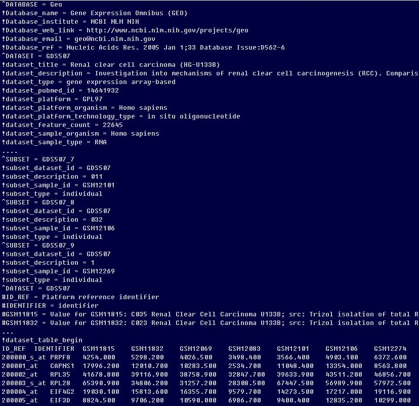
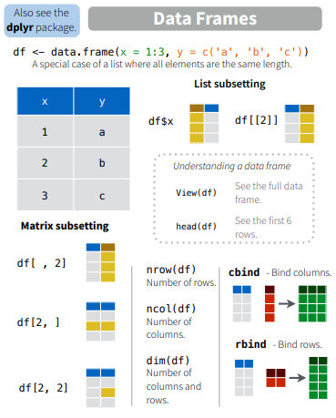

# Bioconductor

Bioconductor는 바이오인포메틱스를 위한 R기반의 데이터, 메소드, 그리고 패키지들의 모음입니다. 2002년 microarray 데이터 분석을 위한 플랫폼으로 시작되었으며 현재 1,300개 이상의 패키지로 구성되어 있습니다. R은 분산형 오픈소스이나 Bioconductor는 Full-time developer들에 의해서 유지되고 있습니다. `CRAN`에 배포되지 않고 `CRAN`에 비해 더 많은 필수 자료들 (vignettes 등)이 필요하며 높은 수준으로 quality control이 되고 있습니다. 현재 RNA-seq, ChIP seq, copy number analysis, microarray methylation, classic expression analysis, flow cytometry 등 다양한 분야의 데이터 분석에 사용되고 있습니다. 


**특징**

Bioconductor 코어 개발 그룹은 사용자들이 지놈스케일 데이터를 더 편리하게 다루룰 수 있도록 데이터의 구조를 개발하는데 많은 시간을 들입니다. 

 * 지놈스케일의 서열이나 발현등 대용량 데이터 관리  
 * 통계적 분석을 용이하게 수행하기 위한 전처리   
 * 분자수준의 현상과 생장이나 질병 등 표현형수준의 관계를 규명하기 위한 정량 데이터 통합   
 * 재사용 가능한 데이터를 위한 관리


## Working with objects

객체지향프로그래밍 (OOP)은 복잡한 문제를 프로그래밍할 때 발생되는 코드의 복잡성을 해결할 수 있는 하나의 방안으로 1990년대부터 많이 사용되었습니다. Genome 스케일의 experiment나 annotation은 대표적인 복잡한 데이터 중 하나 입니다. `bioconcuctor`는 OOP의 개념을 도입하여 이러한 생물학 데이터를 구조화하고 효율적으로 데이터를 관리하고 있습니다. 


```{r, eval=F}
## it takes time at first
if (!requireNamespace("BiocManager", quietly = TRUE))
    install.packages("BiocManager")

BiocManager::install("Homo.sapiens")
```

Class와 Object, Instance 개념을 먼저 이해할 필요가 있습니다.  엄밀히 따지면 Object는 우리가 구현할 대상, Class는 설계도, Instance는 실제 구현한 대상 이라고 이해하시면 좋지만 가끔 Instance와 Object는 같은 의미로 사용되기도 합니다. 예를 들어 우리가 연구하는 `사람`, `원숭이`, `제브라피쉬` 라는 object들의 정보를 저장한다고 생각해 봅니다. 이 경우 각 객체들이 공통적으로 `gene`, `tRNA`, `rRNA` 등의 정보를 가지고 있고 그 기능적 annotation 또한 유사하므로 이러한 정보가 저장되는 공간을 갖는 `생명체`라는 개념적 설계도를 (Class) 먼저 만듭니다. 

그리고 해당 클래스의 `사람`, `원숭이`, `제브라피쉬`를 만들면 각 객체를 일일히 구현할 필요 없이 필요한 정보를 미리 정해진 구조에 맞게 저장만 해주면 됩니다. 예를 들어 다음과 같습니다. 


```{r, eval=F}


```

그런데 이러한 class가 무수히 존재하며 각 class마다 어떠한 정보가 있는지 알 수 없으므로 gene, tRNA 등의 정보에 접근할 수 있는 method들을 제공하고 있습니다. 예를 들어 객체 Homo.sapience를 살펴보면 다음과 같습니다. 

```{r, eval=FALSE}
library(Homo.sapiens)
class(Homo.sapiens)
methods(class=class(Homo.sapiens))
genes(Homo.sapiens)
```

정리하면 bioconductor에는 대용량 정보가 object 형태로 구조화되어 저장되어 있으며 `library()`함수로 읽어올 수 있고 다양한 함수로 해당 object의 정보를  읽어올 수 있습니다. 

```{r, eval=F}
seqinfo(Homo.sapiens)
```

## Discovering, installing, and learning how to use Bioconductor packages

https://www.bioconductor.org

**Discovery**

Use >> Software, Annotation, Experiment

 * Software: 분석을 위한 툴 모음
 * Annotation: 유전자 symbol/ID mapping, gene ontology 기반 유전자 분류, 유전체상에서 exon, transcript, gene 등의 위치, 단백질 기능 등
 * Experiment data: 학습 가능할 정도의 Highly curated datasets (실험 데이터)
 * Workflow: 특정 데이터 분석을 위한 프로세스 모음 
 
**Installation**

`BiocManager`를 먼저 설치하고 해당 패키지를 설치하시기 바랍니다. `BiocManager`에는 `available()`이라는 함수로 (특정 문자가 포함된) 사용 가능한 패키지를 검색할 수 도 있습니다. 

Use >> Software >> IRanges

```{r, eval=F}
if (!requireNamespace("BiocManager", quietly = TRUE))
    install.packages("BiocManager")

BiocManager::install("IRanges")
## .libPaths()
```


**Learning and support**

Learn >> Support site

```{r, eval=F}

library(IRanges)

vignette(package="IRanges")
browseVignettes("IRanges")
vignette("IRangesOverview", package="IRanges")

ir1 <- IRanges(start=1:10, width=10:1)
ir1
class(ir1)
methods(class="IRanges")

example(IRanges)
?IRanges
??IRanges
```


## Data structure and management for genome-scale experiments

잘못된 Data관리로 인한 손실을 줄이기 위해 고도로 효율적이고 신뢰성 높은 데이터 관리 툴이 필요합니다. 과학 연구에서 엑셀 기반의 데이터 관리는 신뢰성과 파이프라인 측면에서 적합하지 않습니다. 즉, 데이터를 관리하기 위해 특정 파이프라인을 만들고 이에 따라서 데이터를 관리할 때 높은 신뢰성의 데이터를 확보할 수 있고 과학적 추론의 바탕이 될 수 있습니다. 따라서 구조를 이해하고 어떻게 사용하는지를 알아야 합니다. Bioconductur에서는 지놈스케일 데이터를 모듈화하고 쉽게 확장 가능한 구조로 만들어서 사용합니다. 


GEO 데이터를 예로 들어 보겠습니다. 

[GEO설명](https://www.ncbi.nlm.nih.gov/geo/info/overview.html) 참고

[GEO accession data GSE62944](https://www.bioconductor.org/packages/release/data/experiment/html/GSE62944.html) 설명 


```{r, eval=F}

if (!requireNamespace("BiocManager", quietly = TRUE))
    install.packages("BiocManager")

BiocManager::install("GSE62944")
library(GSE62944)
browseVignettes("GSE62944")

BiocManager::install("ExperimentHub")
browseVignettes("ExperimentHub")
library(ExperimentHub)

eh = ExperimentHub(localHub=FALSE)

query(eh, "GSE62944")
tcga_data <- eh[["EH1043"]]

```


```{r, eval=F}
gds <- getGEO(filename=system.file("extdata/GDS507.soft.gz",package="GEOquery"))
gsm <- getGEO(filename=system.file("extdata/GSM11805.txt.gz",package="GEOquery"))

```





The Cancer Genome Atlas (TCGA): 암에 관한 유전변이 데이터를 통합 축적하고, 생물정보 분석 목적 (2005, Gene expression, SNP, CNV, DNA methylation, microRNA, Exome)


## Object (variable) type of (storage) mode


## Levels of measurement 

+ Nominal (명목형) – 사람 이름
+ Ordinal (순서형) – 달리기 도착 순서
+ Interval (구간형) – 선수1, 선수2 종점통과 시간
+ Ratio (비율형) – 출발시간 기준 종점 통과 시간


+ Numeric data types 
  + Discrete (이산형) data - 카운트, 횟수
  + Continuous (연속형) data - 키, 몸무게, Cannot be shared
+ Factors data - Categories to group the data
+ Character data - Identifiers 
+ Date and time


## Object - Vectors 

```vector```는 R의 기본 데이터 구조입니다. numeric vector, logical vector, character vector 등 저장되는 값의 타입에 따라 크게 세가지로 나눌 수 있습니다. ```class()``` 함수를 이용해서 값의 타입을 알아낼 수 있습니다. Combine function인 ```c()```를 활용하여 만들며 값을 순차적으로 붙여갈 수 있습니다. 

```{r, eval=FALSE}
x <- c(10.4, 5.6, 3.1, 6.4, 21.7) 
class(x)
y <- c("X1", "Y2",  "X3",  "Y4")
class(y)
z <- c(T, F, F, T)
class(z)
```

이 중 특히 numeric 형식의 벡터를 만드는 다양한 편의 함수들이 존재합니다. 

```{r, eval=F}
1:5
seq(1,5, by=1)
seq(0, 100, by=10)
seq(0, 100, length.out=11)
?seq

rep(5, times=10)
rep(1:3, times=4)
rep(1:3, each=3)
```


### Exercise 3-1 

odds라는 이름의 변수에 1부터 100까지의 홀수만을 저장하시오 (`seq()` 함수 사용) 

---

### Exercise 3-2

`1, 2, 3, 4, 5` 다섯 숫자에 대해서 두 개의 수를 뽑은 후 더해서 나올 수 있는 모든 수를 구하시오 즉, 1+1, 1+2, 1+3, ..., 2+1, 2+2, ..., 5+1, 5+2, ..., 5+5 의 모든 경우에 대한 결과값을 구함 (`rep()` 함수 사용)

---

Logical 벡터는 `True` 또는 `False`를 원소로 갖는 벡터 입니다. 앞글자가 대분자로 시작하는 것을 기억하시고 `T` 또는 `F`와 같이 한 문자로 표현할 수도 있습니다. 특정 조건에 대한 판단 결과를 반환할 경우에도 논리값을 사용합니다. 이 경우 조건을 판단 후 인덱싱 방법으로 해당 값들을 뽑아내기도 합니다. 

```{r, eval=F}
is.na(1)
is.numeric(1)
is.logical(TRUE)

x <- 1:20
x > 13
temp <- x > 13
class(temp)

ages <- c(66, 57, 60, 41,  6, 85, 48, 34, 61, 12)
ages < 30
which(ages < 30)
i <- which(ages < 30)
ages[i]
any(ages < 30)
all(ages < 30)
```


### Exercise 3-3 

1부터 100까지의 수를 n이라는 이름의 변수에 저장하고 이 중 짝수만을 뽑아내서 출력하시오 (`which()`함수 사용) 

---

Character(문자형) 벡터의 경우 문자열을 다루는데 자주 쓰이는 `paste()` 함수의 사용법을 알아두면 편리합니다. `paste()` 함수는 서로 다른 문자열을 붙이는데 주로 사용됩니다. 참고로 문자열을 나누는 함수는 `strsplit()` 입니다. `paste()`에서 붙이는 문자 사이에 들어가는 문자를 지정하는 파라메터는 `sep` 이고 `strsplit()`함수에서 자르는 기준이 되는 문자는`split` 파라메터로 지정해 줍니다 (`?split` 또는 `?paste` 확인).


```{r, eval=F}
paste("X", "Y", "Z", sep="_")
paste(c("Four","The"), c("Score","quick"), c("and","fox"), sep="_")
paste("X", 1:5, sep="")
paste(c("X","Y"), 1:10, sep="")

x <- c("X1", "Y2", "X3", "Y4", "X5")
paste(x[1], x[2])
paste(x[1], x[2], sep="")
paste(x, collapse="_")

strsplit("XYZ", split="")
```


Factor형은 범주형데이터를 저장하기 위한 object 이며 R 언어에서 특별히 만들어져 사용되고 있습니다. `factor()` 함수를 이용해 생성하며 생성된 객체는 다음과 같이 `level`이라는 범주를 나타내는 특성값을 가지고 있습니다.   


```{r, eval=F}
x <- c("Red", "Blue", "Yellow", "Green", "Blue", "Green")
y <- factor(x)
y
```
 
새로운 범주의 데이터를 추가할 경우 다음과 같이 해당되는 level을 먼저 추가하고 값을 저장해야 합니다. 

```{r, eval=F}
levels(y)
y[1] <- "Gold"
y

levels(y) <- c(levels(y), "Gold")
levels(y)
y
y[1] <- "Gold"
y
```


`factor`는 기본적으로 `level`에 표시된 순서가 위치 (정렬) 순서입니다. 이를 바꾸기 위해서는 다음과 같이 `levels` 함수를 이용해서 순서를 바꿀 수 있습니다. 
 
```{r, eval=F}
#library(UsingR)
str(Cars93)
x <- Cars93$Origin
plot(x)
levels(x) <- c("non-USA", "USA")
levels(x)
plot(x)
```
 


vector 들은 다음과 같은 builtin 함수들을 사용해서 해당 변수의 attribute를 알아낼 수 있습니다. attribute에는 원소 이름, 타입, 길이 등 vector형 변수가 가질 수 있는 특성을 말합니다. 

```{r, eval=F}
head(precip)
class(precip)
length(precip)
names(precip)

test_scores <- c(100, 90, 80)
names(test_scores) <- c("Alice", "Bob", "Shirley")
test_scores
```

인덱싱은 vector 데이터의 일부 데이터를 참조할 때 사용하는 방법입니다. 

```{r, eval=F}
x[1]
x[1:3]
i <- 1:3
x[i]
x[c(1,2,4)]
y[3]

head(precip)
precip[1]
precip[2:10]
precip[c(1,3,5)]
precip[-1]
precip["Seattle Tacoma"]
precip[c("Seattle Tacoma", "Portland")]
precip[2] <- 10
```


## Object - matrix

매트릭스는 2차원 행렬로 같은 형식의 데이터 값 (numberic, character, logical) 으로만 채워진 행렬을 말합니다. 메트릭스를 만드는 방법은 아래와 같으며 `nrow` 와 `ncol` 파라메터에 행과 열의 수를 넣고 각 셀에 들어갈 값은 가장 앞에 위치한 data 파라메터에 넣어 줍니다 (`?matrix`로 파라메터 이름 확인). 메트릭스 인덱싱은 메트릭스 안의 값을 저장하거나 참조할때 (빼올때) 사용하는 방법입니다. 메트릭스 변수이름 바로 뒤에 대괄호를 이용해서 제어를 하며 대괄호 안에 콤마로 구분된 앞쪽은 row, 뒷쪽은 column 인덱스를 나타냅니다. 

```{r eval=FALSE}
mymat <- matrix(0, nrow=100, ncol=3) # 1
mymat[,1] <- 1:100 # 2
mymat[,2] <- seq(1,200,2) # 3
mymat[,3] <- seq(2,200,2) # 4
```

매트릭스의 row나 column에 이름이 주어져 있을 경우 이름을 따옴표(")로 묶은 후 참조가 가능합니다. row나 column의 이름은 `rownames()` 또는 `colnames()`로 생성하거나 변경할 수 있습니다. row나 column의 개수는 `nrow()` 또는 `ncol()` 함수를 사용합니다. 

```{r eval=FALSE}
colnames(mymat)
colnames(mymat) <- c("A", "B", "C")
colnames(mymat)
colnames(mymat)[2] <- "D"
colnames(mymat)
rownames(mymat) <- paste("No", 1:nrow(mymat), sep="")
rownames(mymat)
```


여러 row나 column을 참조할 경우 아래와 같이 combine 함수를 사용하여 묶어줘야 하며 스칼라값을 (임의의 숫자 하나) 더하거나 뺄 경우 vector / matrix 연산을 기본으로 수행합니다. 

```{r eval=FALSE}
mymat[c(2,3,4,5),2] # 5
mymat-1 # 6
mysub <- mymat[,2] - mymat[,1] #7
sum(mysub) #8
sum(mysub^2) #8
```

### Exercise 3-4

column이 3개이고 row가 3인 0으로 채워진 m이라는 이름의 matrix를 만들고 m의 각 원소를 1로 채우시오. 

---

## Object - data.frame

데이터프레임은 형태는 매트릭스와 같으나 컬럼 하나가 하나의 변수로서 각 변수들이 다른 모드의 값을 저장할 수 있다는 차이가 있습니다. `$` 기호를 이용하여 각 구성 변수를 참조할 수 있습니다. 컬럼 한 줄이 하나의 변수 이므로 새로운 변수도 컬럼 형태로 붙여 넣을 수 있습니다. 즉, 각 row는 샘플을 나타내고 각 column은 변수를 나타내며 각 변수들이 갖는 샘플의 개수 (row의 길이, vector 의 길이)는 같아야 합니다. R 기반의 데이터 분석에서는 가장 선호되는 데이터 타입이라고 볼 수 있습니다.

```{r eval=FALSE}
## data.frame
ids <- 1:10
ids
idnames <- paste("Name", ids, sep="")
idnames
students <- data.frame(ids, idnames)
students
class(students$ids)
class(students$idnames)
students$idnames
str(students)

students <- data.frame(ids, idnames, stringsAsFactors = F)
class(students$idnames)
students$idnames
students[1,]
str(students)
```

데이터프레임에서도 변수 이름으로 인덱싱이 가능합니다.  

```{r, eval=F}
## data frame indexing 
students$ids
students[,1]
students[,"ids"]
```


## Object - list

리스트는 변수들의 모임이라는 점에서 데이터프레임과 같으나 구성 변수들의 길이가 모두 같아야 하는 데이터프레임과는 달리 다른 길이의 변수를 모아둘 수 있는 점이 다릅니다. 즉, R언어에서 두 변수를 담을 수 있는 데이터 타입은 `list`와 `data frame` 두 종류가 있는데 `list` 변수 타입은 `vector` 형태의 여러개의 element를 가질 수 있으며 각 `vector의` 길이가 모두 달라도 됩니다. list의 인덱싱에서 `[` `]`는 리스트를 반환하고 `[[` `]]`는 vector element들을 반환합니다. 


```{r eval=FALSE}
## list
parent_names <- c("Fred", "Mary")
number_of_children <- 2
child_ages <- c(4, 7, 9)
data.frame(parent_names, number_of_children, child_ages)
lst <- list(parent_names, number_of_children, child_ages)
lst[1]
lst[[1]]
class(lst[1])
class(lst[[1]])
lst[[1]][1]
lst[[1]][c(1,2)]
```




## Missing values

특정 값이 "Not available" 이거나 "Missing value" 일 경우 벡터의 해당 원소 자리에 데이터의 이상을 알리기 위해 `NA`를 사용합니다. 따라서 일반적인 연산에서 `NA`가 포함되어 있는 경우 데이터의 불완전성을 알리기 위해 연산의 결과는 `NA`가 됩니다. `is.na()` 함수는 해당 변수에 `NA` 값이 있는지를 검사해주는 함수이며 R에는 이 외에도 다음과 같은 특수 값들이 사용되고 있습니다. 

* NA: Not available, The value is missing 
* NULL: a reserved value
* NaN: Not a number (0/0)
* Inf: (1/0)

```{r, eval=F}
hip_cost <- c(10500, 45000, 74100, NA, 83500)
sum(hip_cost)
sum(hip_cost, na.rm=TRUE)
?sum
```


## Useful functions I

다음은 벡터형 변수와 같이 쓰이는 유용한 함수들입니다. 

```{r, eval=F}
z <- sample(1:10, 100, T)
head(z)
sort(z)
order(z)
table(z)
p <- z/sum(z)
round(p, digits=1)
digits <- as.character(z)
n <- as.numeric(digits)
d <- as.integer(digits)
```


### Exercise 3-5

* score 라는 변수에 1부터 100까지 중 랜덤하게 선택된 20개의 수로 10 x 2 matrix를 만드시오
* score의 row 이름을 문자형으로 Name1, Name2, ..., Name10으로 지정하시오 (`paste()`변수 사용)
* score의 column 이름을 문자형으로 math와 eng로 지정하시오
* 이 matrix의 첫번째 컬럼과 두 번째 컬럼의 수를 각각 더한 후 total_score라는 변수에 저장 하시오
* total_score 오름차순 순서를 나타내는 인덱스 (`order()`함수 사용)를 o라는 변수에 저장 하시오 
* score를 o순서로 재 배치 하고 score_ordered 변수에 저장 하시오 


---


<a rel="license" href="http://creativecommons.org/licenses/by-nc-nd/4.0/"></a><br />이 저작물은 <a rel="license" href="http://creativecommons.org/licenses/by-nc-nd/4.0/">크리에이티브 커먼즈 저작자표시-비영리-변경금지 4.0 국제 라이선스</a>에 따라 이용할 수 있습니다.

