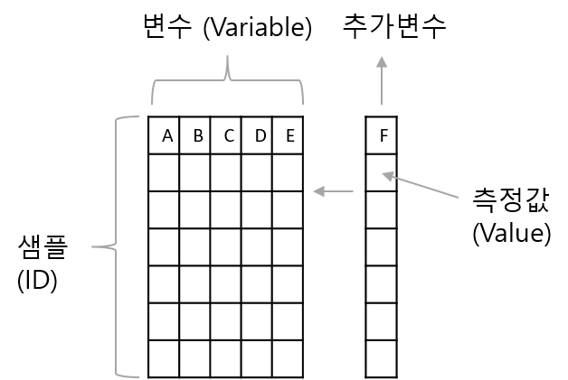

# Data transformation basics 

일반적인 데이터 분석은 데이터 전처리(변환), 가시화, 모델링(통계분석)의  반복적인 수행으로 진행될 수 있습니다. R에서는 `data.frame` 형식의 데이터 타입이 주로 사용되며 (최근 `tibble`형식도 많이 사용됨) 따라서 `data.frame` 기반의 데이터를 다루기 위한 다양한 함수를 익힐 필요가 있습니다. 앞서 설명한 `ggplot2` 패키지는 가시화에 사용되는 대표적인 패키지이고 본 장에서는 `data.frame` 데이터의 전처리나 변환을 위한 함수들을 배워보겠습니다. 먼저 builtin 함수들을 중심으로 설명을 진행하고 이 후에 8장에서 `dplyr` 패키지에 대한 내용을 다루겠습니다. 앞 3장에서 배웠던 데이터를 저장하는 object의 종류를 먼저 간략히 정리해 봅니다.  

 * Vectors - 같은 타입의 데이터를 (Numeric, character, factor, ...) 저장한 오브젝트 타입으로 인덱스는 `[`, `]` 사용. 
 * Lists - 여러개의 `vector`를 원소로 가질 수 있으며 이 원소들은 문자나 숫자 어떤 데이터 타입도 가능하고 길이가 달라도 됨. list의 인덱싱에서 `[` `]`는 리스트를 반환하고 `[[` `]]`는 vector를 반환함.
 * Matrices - 같은 타입의 데이터로 채워진 2차원 행렬이며 인덱스는 `[i, j]` 형태로 i는 row, j는 column 을 나타냄. 메트릭스의 생성은 `matrix` 명령어를 사용하며 왼쪽부터 column 값을 모두 채우고 다음 컬럼 값을 채워 나가는 것이 기본 설정이며 `byrow=T` 를 통해 row를 먼저 채울수도 있음. row와 column 이름은 `rownames`와 `colnames`로 설정이 가능하며 `rbind`와 `cbind`로 두 행렬 또는 행렬과 백터를 연결할 수 있음 ( `rbind`와 `cbind`의 경우 행렬이 커지면 컴퓨터 리소스 많이 사용함)
 * data.frame - `list`와 `matrix`의 장점을 모은 오브젝트 타입으로 `list`와 같이 다른 타입의 `vector`형 변수 여러개가 컬럼에 붙어서 `matrix` 형태로 구성. 매트릭스와 같이 각 변수의 길이가 (row의 길이) 같아야 함. `$` 기호로 각 변수들을 인덱싱(접근) 할 수 있고 matrix와 같이 `[i,j]` 형태의 인덱싱도 가능.

## subset and filter

R에서 데이터 저장은 `data.frame`이나 `matrix` 타입을 일반적으로 사용합니다. 이 데이터의 일부 열 또는 행의 데이터만을 가져와서 별도로 저장하거나 분석이 필요할 경우가 있습니다. 이 때 인덱싱을 사용해서 일부 데이터를 선택하고 사용할 수 있으며 `subset`과 `filter` 함수도 이러한 선별 기능을 제공합니다. `subset`은 행과 열 모두를 선별할 수 있는 함수이고 `filter`는 열 (샘플)을 선택하는 함수입니다. 다음 `airquality` 데이터는 1973년 날짜별로 뉴욕의 공기질을 측정한 데이터 입니다. `NA`를 제외한 나머지 데이터만으로 새로운 데이터셋을 만들어 봅시다. `is.na`함수를 사용하면 해당 데이터가 `NA`일 경우 `TRUE`, `NA`가 아닐 경우 `FALSE` 를 반환해 줍니다. 


```{r, eval=F}
is.na(airquality$Ozone)
ozone_complete1 <- airquality[!is.na(airquality$Ozone),]
ozone_complete2 <- filter(airquality, !is.na(airquality$Ozone))
ozone_complete3 <- subset(airquality, !is.na(Ozone))
```

위 ozone_complete1와 ozone_complete2, ozone_complete3는 같은 결과를 보입니다. 그러나 ozone_complete1, 2보다는 ozone_complete3 코드가 훨씬 직관적이고 가독성이 높습니다. 특히 `airquality$ozone` 로 `$`를 사용하여 변수에 접근한 반면 subset 함수는 `Ozone`이라는 변수 이름을 사용해서 접근함으로써 코드의 간결성과 가독성을 유지할 수 있습니다. 또한 `subset`의 `select` 옵션을 이용해서 변수를 선택할 수도 있으며 `&`(AND)와 `|`(OR) 연산자를 사용해서 조건을 두 개 이상 설정할 수 있습니다. 아래 `select` 옵션에서 `-`는 해당 변수를 제외한다는 의미 입니다. 

```{r, eval=F}
ozone_complete4 <- subset(airquality, !is.na(ozone), select=c(ozone, temp, month, day))
ozone_complete5 <- subset(airquality, !is.na(ozone) & !is.na(solar.r), select=c(-month, -day))
```


### Exercise 7.1 
1) airquality 데이터에서 `Temp`와 `Ozone` 변수로 이루어진 df라는 이름의 `data.frame`을 만드시오 (단 `NA`가 있는 샘플(열)은 모두 제외) 

```{r, eval=F, echo=F}
subset(airquality, !is.na(Temp) & !is.na(Ozone), select=c("Temp", "Ozone"))
```

2) `ggplot`을 이용하여 `Temp`와 `Ozone`의 산포도와 추세선을 그리시오


## merging and split

`merge` 함수는 두 개 이상의 데이터셋을 통합하는 기능을 수행하는 함수입니다. 특히 `rbind`나 `cbind`와는 다르게,  결합하는 두 데이터에 공통적이거나 한 쪽의 데이터를 기준으로 결합을 수행 합니다. `?merge`를 참고하면 `by`, `by.x`, `by.y`, `all`, `all.x`, `all.y` 등의 옵션으로 이러한 설정을 수행할 수 있습니다. 간단한 예제를 통해서 이해해 보겠습니다.  

10명의 사람이 있고 이 사람들의 나이와 성별을 각각 나타낸 두 데이터셋이 있습니다. 그런데 df1은 나이만을 df2는 성별 정보만을 가지고 있으며 두 정보 모두 제공된 사람은 3명 (인덱스 4,5,6) 뿐입니다. 이제 merge를 이용해서 두 데이터셋을 결합해 보겠습니다. 


```{r, eval=F}
## merge
df1 <- data.frame(id=c(1,2,3,4,5,6), age=c(30, 41, 33, 56, 20, 17))
df2 <- data.frame(id=c(4,5,6,7,8,9), gender=c("f", "f", "m", "m", "f", "m"))

df_inner <- merge(df1, df2, by="id", all=F)
df_outer <- merge(df1, df2, by="id", all=T)
df_left_outer <- merge(df1, df2, by="id", all.x=T)
df_right_outer <- merge(df1, df2, by="id", all.y=T)
```

만약 두 데이터셋의 id가 다를 경우나 각각 다른 기준으로 결합해야 하는 경우는 `by`대신 `by.x`, `by.y` 옵션을 사용할 수 있습니다. 

`split` 함수는 데이터를 특정 기준으로 나누는 역할을 하며 해당 기준은 factor 형 벡터 형태로 주어질 수 있습니다.  예를 들어 `airquality` 데이터의 `month` 변수를 기준으로 데이터를 분리해 보겠습니다. 


```{r, eval=F}
str(airquality)
g <- factor(airquality$Month)
airq_split <- split(airquality, g)
class(airq_split)
str(airq_split)
```

위와 같이 `airq_split`은 길이가 5인 (5, 6, 7, 8, 9월) `list`타입이 되었고 각 요소는 서로 다른 size의 `data.frame`형으로 구성 된 것을 확인할 수 있습니다. 


## transforming data

R에서 기존 가지고 있는 데이터의 변경은 새로운 변수의 추가, 삭제, 변형과 샘플의 추가, 삭제, 변형을 생각해 볼 수 있습니다. 이러한 기능은 앞에서 배운 `merge`, `split`이나 `rbind`, `cbind`, 그리고 인덱싱을 활용한 값 변경 등의 방법을 이용할 수 있습니다. 또한 가장 직관적으로 필요한 변수들을 기존 데이터셋에서 추출한 후 `data.frame` 명령어를 사용해서 새로운 데이터셋으로 만들어주면 될 것 입니다. 

이러한 방법들 외에 `within`을 사용할 경우 특정 변수의 변형과 이를 반영한 새로운 데이터셋을 어렵지 않게 만들수 있습니다. `with` 함수의 사용 예와 함께 `within` 함수를 사용하여 데이터를 변형하는 예를 살펴봅니다. `with`나 `within` 함수는 R을 활용하는데 많이 사용되는 함수들은 아닙니다. 또한 이러한 기능들은 `dplyr` 등의 패키지에서 제공하는 경우가 많아서 필수적으로 익힐 부분은 아닙니다. 그러나 개념적인 이해를 돕기위한 좋은 도구들이며 여전히 고수준의 R 사용자들이 코드에 사용하고 있는 함수들이므로 알아두는 것이 좋습니다. 

```{r, eval=F}
## without with
ozone_complete <- airquality[!is.na(airquality$Ozone),"Ozone"]
temp_complete <- airquality[!is.na(airquality$Temp),"Temp"]
print(mean(ozone_complete))
print(mean(temp_complete))

## with
with(airquality, {
  print(mean(Ozone[!is.na(Ozone)]))
  print(mean(Temp[!is.na(Temp)]))
})

```

위 `with` 함수에서 보는바와 같이 `$`를 이용한 변수 접근 대신 `with`함수 내에서는 (`{`, `}` 안에서) 해당 `data.frame`에 있는 변수 이름을 직접 접근할 수 있으며 따라서 코드의 간결함과 가독성이 향상됩니다. 

`within` 함수는 `with`함수와 같이 `{`, `}` 안에서 변수의 이름만으로 해당 변수에 접근이 가능하나 입력된 데이터와 변경된 변수(들)을 반환한다는 점이 다릅니다. 아래 예는 `airquality` 데이터의 화씨 (Fahrenheit) 온도를 섭씨 (Celsius) 온도로 변환해서 새로운 데이터셋을 만드는 코드입니다. `data.frame`을 이용한 코드와 비교해 보시기 바랍니다. 데이터셋 내에서 참조할 변수들이 많아질 경우 `airquality$xxx` 식의 코드를 줄이는 것 만으로도 코드의 가독성과 간결성을 유지할 수 있습니다.  


```{r, eval=F}
newairquality <- within(airquality, {
  celsius = round((5*(Temp-32))/9, 2)
})
head(newairquality)

## data.frame
celsius <- round((5*(airquality$Temp-32))/9, 2)
newairquality <- data.frame(airquality, celsius)
head(newairquality)
```


## Analysis example (babies)

`UsingR` 패키지의 `babies` 데이터를 이용해서 산모의 흡연 여부와 신생아 몸무게의 관계를 알아보는 분석을 수행해 보겠습니다. 본 강의를 통해 배우지 않은 내용들이 있지만 코드를 따라 가면서 참고하시기 바랍니다.  우선 `UsingR` 패키지를 로딩합니다. 산모의 임신 기간이 (gestation) 999로 표기된 데이터는 명백히 에러이며 이들을 `NA`로 처리합니다.  

```{r, eval=F}
library(UsingR)
library(ggplot2)
head(babies)
## a simple way to checkout the data
plot(babies$gestation)  
## or using ggplot...
ggplot(babies, aes(x=1:length(gestation), y=gestation)) + 
  geom_point()
babies$gestation[babies$gestation>900] <- NA
str(babies)
```

아래와 같이 `within` 함수를 사용해서 `babies$` 를 반복해서 입력해주는 불편함을 줄이고 가독성을 높입니다. 똑같은 방법으로 `dwt` (아빠의 몸무게) 변수의 에러값들에 대해서도 `NA` 처리를 할 수 있습니다. 


```{r, eval=F}
new_babies <- within(babies, {
  gestation[gestation==999] <- NA
  dwt[dwt==999] <- NA
})
str(new_babies)
```

`smoke` 변수는 흡연 여부를 나타내는 범주형 변수로 0, 1, 2, 3 값은 의미가 없습니다. 사람이 읽을 수 있는 label을 붙인 `factor` 형 변수로 변환하는 코드도 함께 작성해 보겠습니다. 

```{r, eval=F}
str(babies$smoke)
new_babies <- within(babies, {
  gestation[gestation==999] <- NA
  dwt[dwt==999] <- NA
  smoke = factor(smoke)
  levels(smoke) = list(
    "never" = 0, 
    "smoke now" = 1, 
    "until current pregnancy" = 2,
    "once did, not now" = 3)
  })
str(new_babies$smoke)
```

이제 임신기간과 흡연 여부를 분석해 볼 수 있습니다. 흡연 그룹별로 기간에 차이가 있는지를 알아보는 분석은 t-test나 ANOVA를 사용할 수 있습니다. 

```{r, eval=F}
fit <- lm(gestation~smoke, new_babies)
summary(fit) ## t-test 결과 
anova(fit)
```

간단히 결과를 보면 `summary(fit)`은 3가지 t-test의 결과를 보여줍니다. never vs. smoke new 의 경우 t값이 -1.657로 피우지 않은 경우에 비해서 피우는 사람의 임신 기간이 유의하게 줄어들었음을 알 수 있습니다. 그에 비해서 현재 흡연하지 않는 경우 (never vs. until current pregnancy 또는 never vs. once did, not now) 차이가 없는 것으로 나옵니다. 

이제 smoke now 인 경우 또는 나이가 25세 미만인 경우의 샘플에 대해서 `newdf`를 만들어 봅니다 (`subset` 함수 사용, id, gestation, age, wt, smoke 변수 선택). 이 후 `ggplot`을 이용하여 몸무게와 임신기간의 산점도를 그려보면 크게 다르진 않으나 흡연하는 여성 중 몸무게가 적게 나가는 여성에게서 짧은 임신기간을 갖는 경향을 볼 수 있습니다. 

```{r, eval=F}

newdf <- subset(new_babies, (smoke=="smoke now" | smoke == "never") & age < 25, select=c(id, gestation, age, wt, smoke))
ggplot(newdf, aes(x=wt, y=gestation, color=smoke)) +
  geom_point(size=3, alpha=0.5) +
  facet_grid(.~smoke) + 
  theme_bw()

```


### Exercise 7.2 
다음 df 의 hour, minute, second로 나누어진 값들을 초 단위로 변환하여 seconds라는 변수에 저장한 후 기존 df에 추가한 df2 데이터셋을 만드시오 (`within` 함수 이용)

```{r, eval=F}
df <- data.frame(hour=c(4, 7, 1, 5, 8),
                 minute=c(46, 56, 44, 37, 39),
                 second=c(19, 45, 57, 41, 27))
```


## apply 

앞서까지는 데이터를 변형할 때 사용하는 다양한 함수들을 살펴 보았습니다. `apply`는 데이터를 변형하기 위한 함수라기 보다는 데이터를 다룰 때 각 원소별, 그룹별, row, 또는 column 별로 반복적으로 수행되는 작업을 효율적으로 수행할 수 있도록 해주는 함수입니다. `apply` 계열의 함수를 적절히 사용하면 효율성이나 편리성 뿐만 아니라 코드의 간결성 등 많은 장점이 있습니다. 쉬운 이해를 위해 `colMean` 함수를 예로 들면 `colMean`은 column 또는 row 단위로 해당하는 모든 값들에 대해 평균을 계산해주는 함수이고 `apply`를 사용할 경우 다음과 같이 `apply` 함수와 `mean` 함수를 이용해서 같은 기능을 수행할 수 있습니다. 아래는 `babies` 데이터의 clearning 된 (위에서 만들었던) `new_babies` 데이터에  이어서 수행되는 내용입니다. 


```{r, eval=F}
head(new_babies)
df <- subset(new_babies, select=c(gestation, wt, dwt))
colMeans(df, na.rm=T)
apply(df, 2, mean, na.rm=T)
```

위와 같이 `colMeans`와 `apply`가 똑같은 결과를 보여주고 있습니다. 두 번째 인자인 margin의 값으로 (`?apply`참고) 여기서는 `2`가 사용되었으며 margin 값이 1인지 2인지에 따라서 다음과 같이 작동을 합니다. 


`mean`외에도 다양한 함수들이 사용될 수 있으며 아래와 같이 임의의 함수를 만들어서 사용할 수 도 있습니다. 아래 코드에서는 `function(x)...`로 바로 함수의 정의를 넣어서 사용했으나 그 아래 `mysd` 함수와 같이 미리 함수 하나를 만들고 난 후 함수 이름을 이용해서 `apply`를 적용할 수 있습니다. 

```{r, eval=F}

apply(df, 2, sd, na.rm=T)
apply(df, 2, function(x){ 
  xmean <- mean(x, na.rm=T) 
  return(xmean)
  })

```

`apply` 함수는 특히 R에서 느리게 작동하는 loop (`for`, `while` 등) 문 대신 사용되어 큰 행렬에 대해서도 빠른 계산 속도를 보여줄 수 있습니다.  

```{r, eval=F}
n <- 40
m <- matrix(sample(1:100, n, replace=T), ncol=4)
mysd <- function(x){
  xmean <- sum(x)/length(x)
  tmpdif <- x-xmean
  xvar <- sum(tmpdif^2)/(length(x)-1)
  xsd <- sqrt(xvar)
  return(xsd)
}

## for 
results <- rep(0, nrow(m))
for(i in 1:nrow(m)){
  results[i] <- mysd(m[i,])
}
print(results)
apply(m, 1, mysd)
apply(m, 1, sd)
```

`apply` 함수 외에도 `sapply`, `lapply`, `mapply` 등의 다양한 `apply`계열 함수가 쓰일 수 있습니다. 먼저 `lapply`는 `matrix` 형태 데이터가 아닌 `list` 데이터에 사용되어 각 `list` 원소별로 주어진 기능을 반복해서 수행하며 `sapply`는 `lapply`와 유사하나 벡터, 리스트, 데이터프레임 등에 함수를 적용할 수 있고 그 결과를 벡터 또는 행렬로 반환합니다. 


```{r, eval=F}

x <- list(a=1:10, b=exp(-3:3), logic=c(T,T,F,T))
mean(x$a)
lapply(x, mean)
sapply(x, mean)

x <- data.frame(a=1:10, b=exp(-4:5))
sapply(x, mean)

x <- c(4, 9, 16)
sapply(x, sqrt)
sqrt(x)

y <- c(1:10)
sapply(y, function(x){2*x})
y*2
```

마지막 예제에서처럼 `sapply`나 `lapply`도 임의의 함수를 만들어 적용시킬 수도 있습니다. 자세히 살펴 보면 y는 10개의 값을 갖는 벡터이고 이 벡터의 각 원소 (값에) 함수를 반복해서 적용하는 것 입니다. 함수에서 `x`는 각 원소의 값을 차례차례 받는 역할을 하므로 1부터 10까지 값이 함수로 들어가 2를 곱한 수가 반환됩니다. 따라서 벡터연산을 하는 `y*2`와 결과가 같으나 원하는 함수를 정의해서 자유롭게 사용할 수 있다는 장점이 있습니다. 리스트의 경우는 다음과 같이 사용합니다. 

```{r, eval=F}
y <- list(a=1:10, b=exp(-3:3), logic=c(T,T,F,T))
myfunc <- function(x){
  return(mean(x, na.rm=T))
}
lapply(y, myfunc)
unlist(lapply(y, myfunc))
```

즉, `myfunc`의 `x`가 list y의 각 원소들, y[[1]], y[[2]], y[[3]]를 각각 받아서 `mean` 연산을 수행해 줍니다. 결과로 각 `list` 원소들의 평균 값이 반환되며 `unlist` 함수는 `list` 형태의 반환 값을 `vector` 형태로 전환해 줍니다. 


### Exercise 7.3 
다음은 앞에서 수행했던 `airquality` 데이터를 월별로 나눈 데이터셋임. 이 데이터셋을 이용하여 각 월별로 온도와 오존 농도의 평균값을 저장한 `data.frame` 형식의 데이터를 만들기 위하여 다음 단계별 과정에 적절한 코드를 작성하시오 

```{r, eval=F}
## dataset
g <- factor(airquality$month)
airq_split <- split(airquality, g)
```

1) 다음 `df`의 `ozone` 평균을 구하는 `ozone_func` 함수를 작성하시오 (단 입력은 `data.frame` 형식의 오브젝트를 받고 출력은 평균값 (정수 값 하나) 출력. `mean` 함수 사용시 데이터에 `NA`가 포함되어 있을 경우 `na.rm=T` 옵션 적용)

```{r, eval=F}
## May data.frame
df <- airq_split[[1]]
#
# write your code here for ozone_func function
#

## Usage
ozone_func(df)
## output
# 23.61538
```

2) `lapply`와 `ozone_func` 함수를 사용하여 `airq_split` list 데이터의 월별 `ozone` 평균 값을 구하고 `ozone_means`에 `vector` 형식으로 저장하시오 

3) 위 1), 2)와 같은 방법으로 `temp_func` 함수를 만들고 월별 `temp`의 평균값을 `temp_means`에 `vector` 형식으로 저장하시오. 

4) 위에서 구해진 두 변수값들을 이용하여 `air_means` 라는 이름의 `data.frame`으로 저장하시오  


```


<!-- ## Long and wide data structure  -->

<!-- 실험을 디자인하고 데이터를 생성하는 사람과는 달리 데이터 분석 전문가의 입장에서 처음 데이터를 받은 후 분석에 필요한 변수와 값을 구분하는 일은 적절한 데이터 분석을 위해 필수적인 과정입니다. 특히 복잡하고 사이즈가 큰 데이터일 경우는 더욱 중요할 수 있으나 대부분 경험에 의존해서 구분이 진행되고 있습니다.  데이터를 Long 또는 Wide 형으로 이해하고 자유롭게 전환하는 능력은 복잡한 데이터의 성공적인 분석과 체계적인 분석 방법을 수립하는데  기여할 수 있습니다.  -->

<!-- Wide형 데이터의 경우 샘플 데이터가 늘어날수록 row에 쌓이고 새로운 변수는 column에 쌓이는 방식으로 데이터가 확장되는 형태 입니다. 엑셀에서 볼 수 있는 일반적인 형식으로 다음 그림과 같습니다.  -->

<!--  -->

<!-- long 형 데이터의 경우 ID, variable, value 세가지 변수만 기억하면 되겠습니다. 위 wide형 데이터 경우를 보면 ID, variable, 그리고 value 이 세가지 요인이 주요 구성 요소임을 알 수 있습니다. 샘플을 참조할 수 있는 어떤 변수 (variable)도 ID가 될 수 있으며 2개 이상의 변수가 ID로 지정될 수 있습니다. 참고로 ID를 지정할 경우 해당 ID는 가능하면 중복되지 않는 값들을 갖는 변수를 사용해야 식별자로서 기능을 적절히 수행할 수 있습니다. Long형을 사용할 경우 데이터의 변수가 늘어나도 행의 수만 늘어나므로 코드의 간결성과 변수들의 그룹을 만들어서  분석하는 등의 장점이 있습니다.  -->

<!-- 일반적으로 얻어지는 데이터의 형태는 wide형이며 이를 long형으로 변환하기 위해서는 앞에서 잠깐 소개했던 `reshape2` 패키지의 `melt`함수를 사용합니다. 그 반대의 경우 `dcast` 함수를 사용하면 됩니다. `tidyverse` 패키지에 속한 `tidyr` 패키지의 `gather`와  `spread`를 사용할 수도 있습니다. 본 강의에서는 `reshape2` 패키지를 사용합니다. `melt` 함수의  data.frame 에 대한 도움말을 보면 `id.vars` 와 `measure.vars` 파라메터들을 볼 수 있으며 이들이 앞서 설명한 id가 될 변수와 value가 될 변수를 지정해 주는 옵션 입니다. `value.name`을 이용해서 value 값들을 저장하는 변수 이름을 바꿔줄 수 있으며 따로 설정하지 않는 경우 "value"라는 이름으로 저장 됩니다.  -->

<!--  -->

<!-- `airquality` 데이터는 전형적인 wide형 데이터로 특정 날짜에 네 개의 변수에 해당하는 값들을 측정했습니다. 이 데이터를 long형으로 바꿀 경우 ID를 날짜로 하면 데이터들을 식별 할 수 있습니다. 확인을 위해 상위 5개의 데이터만 가지고 형 변환을 진행해 보겠습니다.  -->


<!-- ```{r, eval=F} -->
<!-- library(reshape2) -->
<!-- myair <- airquality[1:5,] -->
<!-- myair -->
<!-- myair_mlt <- melt(myair, id.vars=c("month", "day")) -->
<!-- myair_mlt -->
<!-- ``` -->

<!-- `ggplot`을 이용한 그래프 작성에는 위와 같은 long형 데이터가 주로 사용됩니다. R을 이용한 데이터 가시화는 이번 장에서 배우는 `dplyr` 패키지로 wide형 데이터를 편집하고 `melt` 함수로 long형 데이터로 변환 후 `ggplot`으로 가시화하는 과정을 거치게 됩니다. 두 데이터 포멧에 대한 좀 더 구체적인 내용은 다음 링크를 참고하시기 바랍니다.  -->
<!-- https://www.theanalysisfactor.com/wide-and-long-data/  -->


<!-- ## ddplyr - pipe operator -->

<!-- `dplyr` (https://dplyr.tidyverse.org/) 역시 해들리위컴이 (Hadley Wickham) 중심이 되어 만들어 졌으며 `ggplot2`와 함께 `tidyverse`의 (https://www.tidyverse.org/) 핵심 패키지 입니다. 데이터 변환은 R의 builtin 함수에서 이미 제공하는 기능입니다. `dplyr`은 이러한 기능들에 데이터 크기나 분석의 속도, 편의성을 향상시켜 새롭게 만들어놓은 패키지 입니다. 따라서 R을 좀 더 쉽게 이해하기 위해서 기존 함수들을 이용한 기본적인 데이터 변환에 대한 내용을 알아둘 필요가 있습니다. -->

<!-- dplyr은 테이블형 데이터를 다루기 위한 도구를 제공하는 매우 편리한 패키지 입니다. 앞서 ggplot의 `+` 오퍼레이터와 같이 `%>%` 파이프 오퍼레이터를 사용하여 여러 함수를 연속적으로 사용할 수 있으며 R의 장점 중 하나인 apply와 같은 행렬 연산 기능을 subset, split, group 와 같은 행렬 편집 기능과 더하여 만들어낸 도구라고 할 수 있습니다. -->

<!-- 먼저 파이프 오퍼레이터 ```%>%``` 의 작동법은 간단히 ```%>%```의 왼쪽 코드의 결과를 출력으로 받아 오른쪽 코드의 입력 (첫번째 파라미터의 값)으로 받아들이는 작동을 합니다. 다음 예에서 보면 ```sin(pi)``` 와 같은 함수의 일반적인 사용법 대신  ```pi %>% sin``` 처럼 사용해도 똑같은 결과를 보여줍니다. ```cos(sin(pi))```와 같이 여러 합수를 중첩하여 사용할 경우에도 코드 디자인의 가독성이나 효율 측면에서 크게 향상된 방법을 제공해 줍니다. -->


<!-- ```{r  warning=FALSE, message=FALSE} -->
<!-- library(dplyr) -->

<!-- pi %>% sin -->
<!-- sin(pi) -->
<!-- pi %>% sin %>% cos -->
<!-- cos(sin(pi)) -->
<!-- ``` -->


<!-- 특히 ``` %>% ```는 이후 설명할 dplyr의 group_by, split, filter, summary 등의 행렬 편집/연산 함수를 빈번히 다양한 조합으로 쓰게되는 상황에서 더 큰 효과를 발휘할 수 있습니다. 그에 앞서 pipe 오퍼레이터의 예제를 좀 더 살펴보겠습니다. -->

<!-- pipe operator의 왼쪽 구문의 결과가 오른쪽 구문의 입력으로 처리된다고 설명드렸지만 엄밀히 따지면 오른쪽 구문의 첫 번째 파라미터의 입력 값으로 처리되는 것 입니다. 즉, 함수에서 사용되는 파라미터가 여러개일 경우가 있으므로 기본적으로 ``` %>% ``` 의 왼쪽 구문의 출력 값은 오른쪽 구문 (함수)의 첫 번째 인자의 입력값으로 들어가는 것 입니다. 이는 다음 예들을 통해서 명확히 알 수 있습니다. 먼저  ```paste```함수는 그 파라미터로 ```,```로 구분되는 여러개의 입력 값을 가질 수 있습니다. 따라서 다음 코드는 ```x```가 paste의 첫 번째 파라미터로 들어가게 되어 ```"1a", "2a", "3a", "4a", "5a"``` 로 a 앞에 x 값들이 붙어서 출력된 것을 알 수 있습니다. -->


<!-- ```{r} -->
<!-- x <- 1:5 -->
<!-- x %>% paste("a", sep="") -->
<!-- ``` -->

<!-- 특정 데이터셋의 컬럼별 평균을 구하고 각 평균의 합을 구할 경우를 생각해 봅시다. R에서는 ```colMeans```라는 특별한 함수를 제공하여 컬럼별로 평균을 계산해 줍니다. 그 후 sum 함수를 사용하여 최종 원하는 값을 얻을 수 있습니다. 이러한 코드를 ```%>%``` 오퍼레이터를 사용한 경우의 코드와 비교해 볼 수 있습니다. -->

<!-- ```{r} -->
<!-- x <- data.frame(x=c(1:100), y=c(201:300)) -->
<!-- sum(colMeans(x)) -->

<!-- x <- data.frame(x=c(1:100), y=c(201:300)) -->
<!-- x %>% colMeans %>% sum -->
<!-- ``` -->


<!-- 그럼 만약 두 번째 파라미터에 입력으로 왼쪽 구문의 출력을 받아들이고 싶을 경우는 어떻게 할까요? 그럴때는 place holer라는 ```.``` 을 사용하면 되겠습니다. round 함수는 두 개의 파라미터를 가지고 digits 값을 pipe operator로 넘겨주고 싶을 경우 아래와 같이 표현할 수 있습니다. -->

<!-- ```{r} -->
<!-- 6 %>% round(pi, digits=.) -->
<!-- round(pi, digits=6) -->
<!-- ``` -->


<!-- ## dplyr - Important functions -->

<!-- 이제 본격적인 dplyr 함수를 사용해 보겠습니다. dplyr을 구성하는 중요한 함수는 다음 6가지가 있습니다. -->

<!-- * select() -	select columns -->
<!-- * filter() -	filter rows -->
<!-- * arrange() -	re-order or arrange rows -->
<!-- * mutate() -	create new columns -->
<!-- * summarise() -	summarise values -->
<!-- * group_by() -	allows for group operations in the “split-apply-combine” concept -->

<!-- 이 함수들은 ``` %>% ```와 함께 쓰이면서 강력한 성능을 발휘합니다. summarise 함수는 특정 값들의 통계 값을 계산해 주는 함수이며 그 외 5개 함수들은 행렬 편집을 위한 함수들로 보시면 되겠습니다. 각각의 설명보다는 직접 간단한 예제를 수행하면서 각각의 기능을 살펴보고 왜 dplyr이 널리 사용되고 그 장점이 무엇인지 파악해 보도록 하겠습니다. -->

<!-- 예제에 사용할 데이터는 iris 데이터로 R을 설치하면 기본으로 들어있는 데이터 입니다. 세 종류의 iris 품종에 대한 꽃잎과 꽃받침의 length와 with를 측정해 놓은 데이터 입니다. ```head```와 ```str``` 명령어를 이용해서 데이터를 살펴 봅니다. ```%>%```를 배웠으니 써보겠습니다. -->

<!-- ```{r} -->
<!-- iris %>% head(10) -->
<!-- iris %>% str -->
<!-- ``` -->

<!-- 데이터를 확인한 후 분석을 시작합니다. 분석은 간단히 각 iris 품종별로 꽃과 꽃받침의 평균을 비교하는 것으로 합니다. -->


<!-- dplyr의 전신이라 할 수 있는 plyr 패키지는 다음과 같이 설명이 되어 있습니다. *A set of tools for a common set of problems: you need to split up a big data structure into homogeneous pieces, apply a function to each piece and then combine all the results back together.* 즉 split-apply-combine 세 가지 동작을 쉽게 할 수 있도록 만들어 놓은 툴 입니다. R이 다른 언어에 비해 데이터 분석에서 주목을 받는 이유로 split, apply 등의 행렬 연산 함수가 발달한 것을 내세우는데 dplyr은 이들보다 더 편리하게 데이터 조작을 할 수 있도록 만들어 놓은 것 입니다. -->


<!-- 이제 split, apply, combine을 활용하여 평균을 구하는 코드와 dplyr 패키지를 사용하여 만든 코드를 비교해 보도록 하겠습니다. split은 factor형 변수인 Species를 기준으로 iris 데이터를 나누어 주는 역할을 하며 lapply는 list 형 데이터인 iris_split을 각 리스트의 각각의 원소들에 대해서 function(x) 를 수행하는 역할을 합니다. 마지막 data.frame으로 최종 경로를 merge 합니다. -->

<!-- ```{r} -->
<!-- iris_split <- split(iris, iris$Species) -->
<!-- iris_means <- lapply(iris_split, function(x){colMeans(x[,1:4])}) -->
<!-- iris_means_df <- data.frame(iris_means) -->
<!-- iris_means_df -->
<!-- ``` -->

<!-- 위 코드를 한 줄로 사용하여 최종 iris_means_df 데이터를 를 구한다면 다음과 같이 됩니다. 한눈에 코드가 들어오지 않고 이렇게 중첩해서 함수를 사용하는 습관은 어떤 프로그래밍 언어에서도 권장하지 않습니다. -->

<!-- ```{r} -->
<!-- iris_means_df <- data.frame(lapply(split(iris, iris$Species), function(x){colMeans(x[,1:4])})) -->
<!-- ``` -->


<!-- 아래는 dplyr 패키지를 사용한 코드 입니다. -->

<!-- ```{r} -->
<!-- iris_means_df2 <- iris %>% group_by(Species) %>% summarise_all(mean) -->
<!-- iris_means_df2 -->
<!-- ``` -->


<!-- 위에서 보듯 dplyr 패키지를 사용할 경우 그 결과는 같으나 코드의 가독성과 효율성면에서 장점을 보여줍니다. 여기서 group_by, summarise_all 함수 등의 사용법은 help 페이지를 참고해 주세요. 간단히 iris 데이터를 받아서 Species에 명시된 그룹으로 나누고 mean 함수를 모든 컬럼에 대해서 사용하라는 의미 입니다. -->

<!-- 이제 ggplot을 이용하여 각 평균에 대한 barplot을 그려보도록 하겠습니다. 지난 예제와는 달리 ggplot에서는 data만 명시해 주고 geom_bar에 aes와 stat을 모두 사용한 것이 다릅니다. ggplot 구문에서 지정해주는 aes 등의 옵션은 하위 geom_xxx 레이어들에 모두 적용이 되고 각 geom_xxx 레이어에서 지정해주는 aes는 해당 레이어에서만 효과를 나타냅니다. -->


<!-- ```{r} -->
<!-- ggplot(iris_means_df2) + -->
<!--   geom_bar(aes(x=Species, y=Sepal.Length), stat="identity") -->
<!-- ``` -->


<!-- 마지막으로 위 dplyr 패키지를 ggplot 과 함께 사용할 수도 있습니다. 보통은 앞서와 같이 결과를 특정 변수에 저장한 후 도표 등을 그리지만 다음과 같이 ```%>%``` 를 사용하여 plot 까지 함께 볼 수도 있습니다. -->

<!-- ```{r} -->
<!-- iris %>% -->
<!--   group_by(Species) %>% -->
<!--   summarise_all(mean) %>% -->
<!--   ggplot() + -->
<!--   geom_bar(aes(x=Species, y=Sepal.Length), stat="identity") -->
<!-- ``` -->


<!-- 다음시간에는 dplyr 패키지를 이용하여 실제 예제 데이터의 평균과 표준편차를 구해보고 bar graph외 산포도, heatmap 등의 실습을 해 보도록 하겠습니다. -->


---


<a rel="license" href="http://creativecommons.org/licenses/by-nc-nd/4.0/"></a><br />이 저작물은 <a rel="license" href="http://creativecommons.org/licenses/by-nc-nd/4.0/">크리에이티브 커먼즈 저작자표시-비영리-변경금지 4.0 국제 라이선스</a>에 따라 이용할 수 있습니다.

